# 第一节 环境准备

---

欢迎各位学习者来到 LazyLLM 的教程。说实话，当我开始写这句话的时候，我都是**既兴奋又头疼**的状态——兴奋是因为又有新玩具了，头疼是因为又得折腾环境了。

LazyLLM 号称是低代码构建多 Agent 应用的利器，用下来确实有点东西。最让我惊喜的是它那个**原型搭建 → 数据回流 → 迭代优化**的流程，也就是说可以**先基于 LazyLLM 快速跑通应用的原型**，再结合场景任务数据进行分析，然后对应用中的关键环节进行优化，进而逐步提升整个应用的效果，特别适合我这种喜欢先跑通再优化的人。

好了，废话不多说，咱们开始配环境吧。虽然步骤有点多，但跟着走一遍其实挺简单的。

## **第一步：装个趁手的编辑器**

---

既然使用 LazyLLM 这个框架，就必然少不了集成开发环境。我个人是 VS Code 的死忠粉。用了这么多年，从 Sublime 到 Atom 再到 VS Code，最后还是觉得微软这个最顺手。点击[官方下载链接](https://code.visualstudio.com/Download)，根据你自己的操作系统下载。

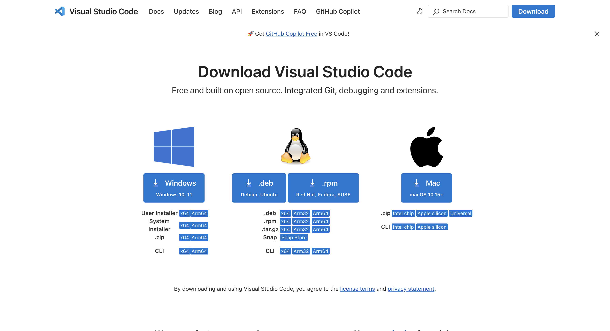

### 针对 Windows 系统用户的注意事项：

**Windows 系统**用户下载好之后，双击 exe 文件，选择**我同意此协议**：


点击下一步选择软件安装目录，点击下一步选择是否创建开始菜单文件夹，点击下一步选择附加任务，安装的时候记得勾选**添加到 PATH**那个选项！我第一次装的时候就忘了勾，后来在**命令行里死活找不到 code 命令**，折腾了半天才发现是这个问题。

还有就是桌面快捷方式也勾上吧，方便。


点击**安装**，之后点击**完成**按钮即可完成安装。


### 针对 macOS 系统用户的注意事项：

Mac 用户就简单多了，**下载完把那个图标拖到应用程序文件夹就完事儿**。我记得我第一次用 Mac 的时候，还傻乎乎地双击想安装，结果直接就打开了...后来才知道 Mac 很多软件都是拖进去就行。


## **第二步：无痛配置 Python 环境**

由于 LazyLLM 软件包基于**Python 3.12 环境**运行，因此需要安装特定版本的 Python，打开[Python 3.12 版本官方网站](https://www.python.org/downloads/release/python-3120/)，Windows 系统用户点击[Windows installer (64-bit)](https://www.python.org/ftp/python/3.12.0/python-3.12.0-amd64.exe)下载，macOS 用户点击[macOS 64-bit universal2 installer](https://www.python.org/ftp/python/3.12.0/python-3.12.0-macos11.pkg)下载：

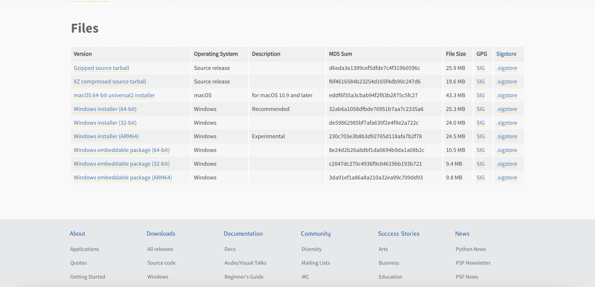

### 针对 Windows 系统用户的注意事项：

**Windows 系统**用户下载好 Python 之后，双击 exe 文件，千万记得**勾选下方管理员权限和 Add python.exe to PATH 这两个选项**（我见过太多新手因为没勾这个，后面各种报错找不到 python 命令），点击**Install Now**安装：


安装完成以后，按`WIN+R`键盘，输入`cmd`打开 Windows 的命令行程序（命令提示符），在窗口中输入`python`命令（注意字母`p`是小写的），如果出现 Python 的版本信息，并看到命令提示符`>>>`，就说明安装成功了，如下图所示。

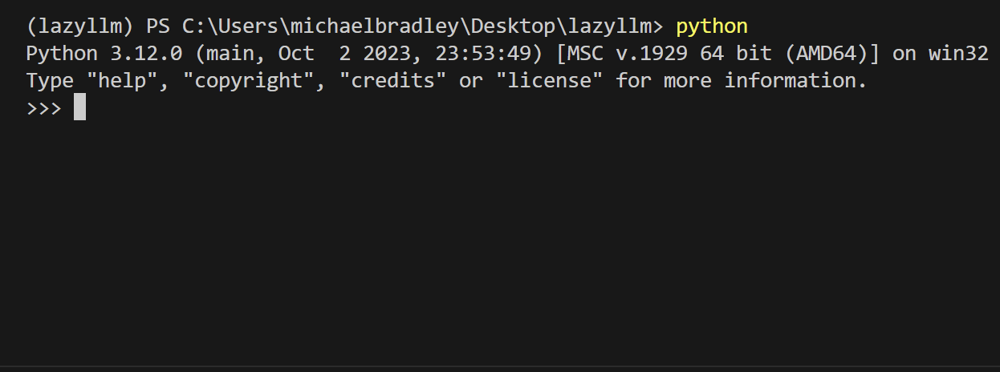

### 针对 macOS 系统用户的注意事项：

Mac 用户装 Python 相对省心，下载好 Python 之后，双击 pkg 文件，基本一路点**继续和同意**就行。装完在终端输入`python3`（注意 Mac 可能需要用`python3`而不是`python`）验证一下。

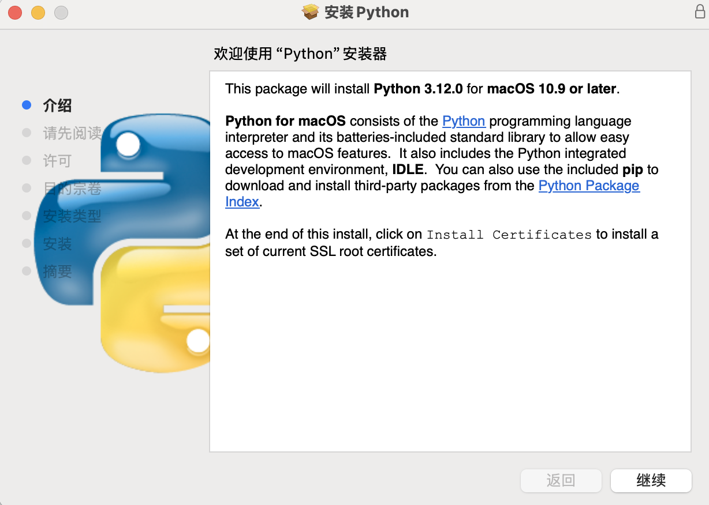

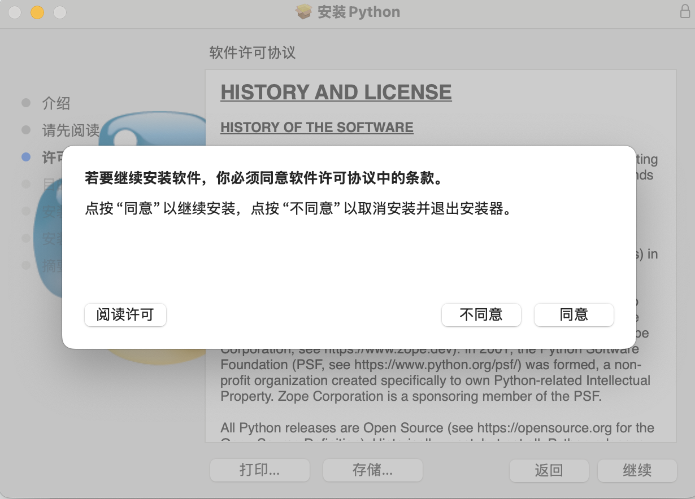

安装完成以后，打开**终端**，在窗口中输入`python3`命令（注意字母`p`是小写的），如果出现 Python 的版本信息，并看到命令提示符`>>>`，就说明安装成功了，如下图所示。

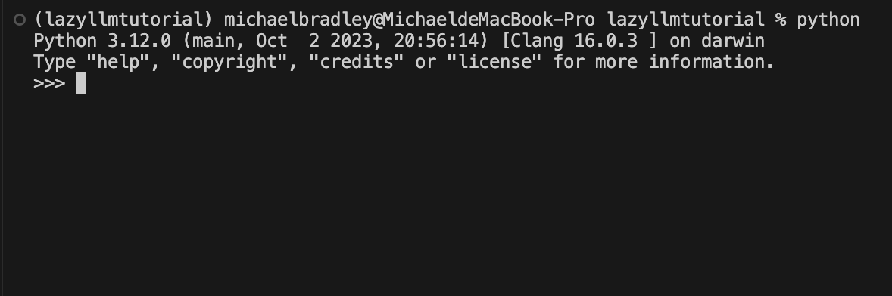

装完 Python 别忘了在 Visual Studio Code 里装**Python 扩展，用来对 Python 代码解释。**

打开 Visual Studio Code，左边栏点击扩展图标，搜 Python，第一个**Microsoft 官方**的装上就行。

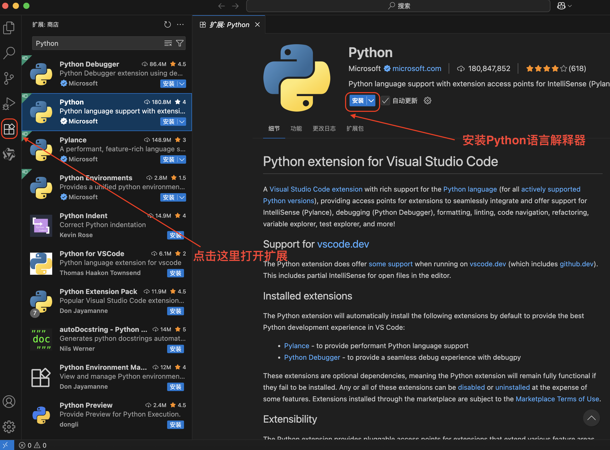

顺便说一句，如果你英文不太好，可以顺手装个中文语言包，搜**简体中文**就能找到。

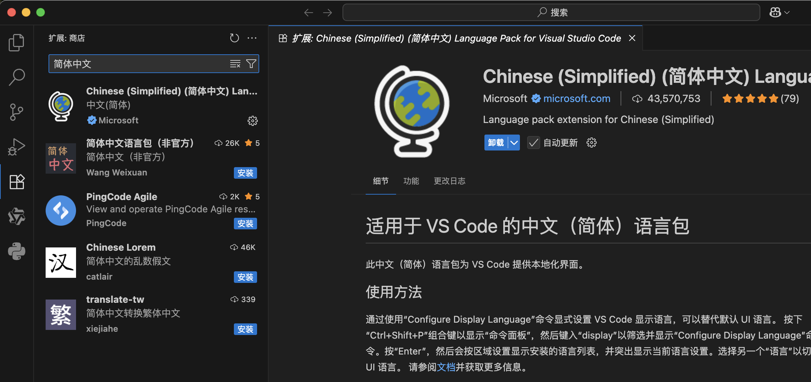

## 第三步：**终于要装 LazyLLM 了**

---

打开 Visual Studio Code，点击左侧的**启动-打开...，新建一个空文件夹打开，之后会跳转到项目工作区。**

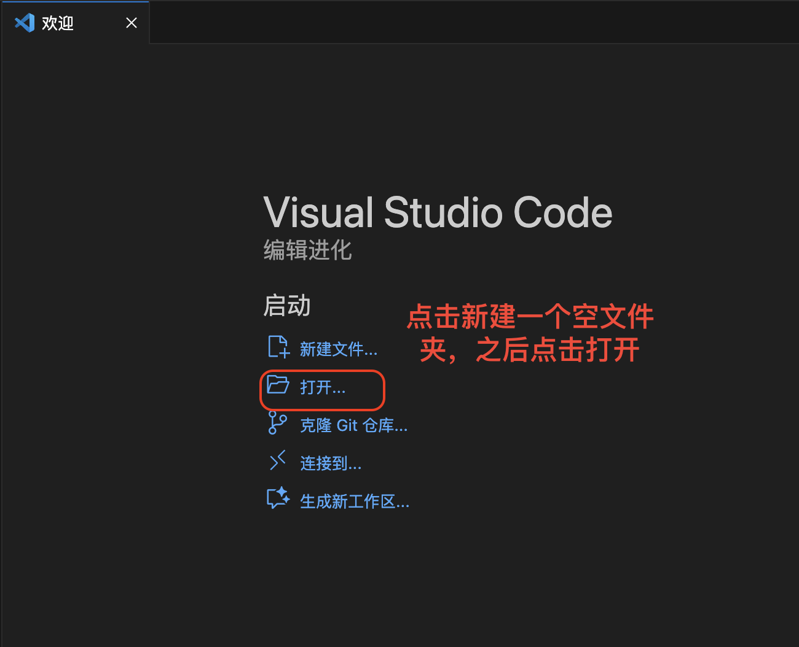

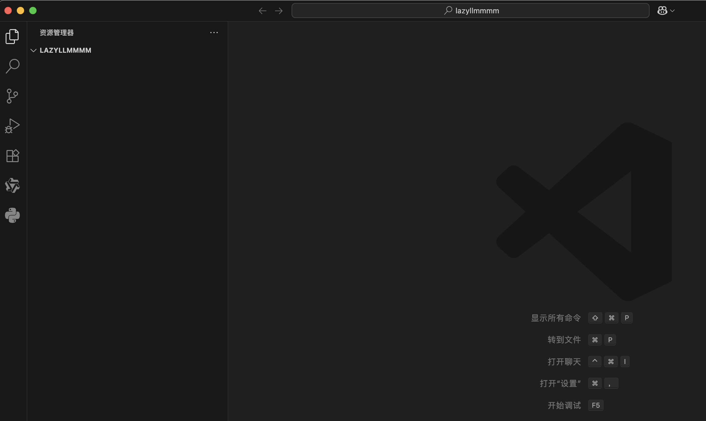

点击**终端——新建终端，** 输入以下命令安装 LazyLLM，安装过程会持续一段时间：

```bash
pip install lazyllm
```

至此，项目环境正式配置成功。

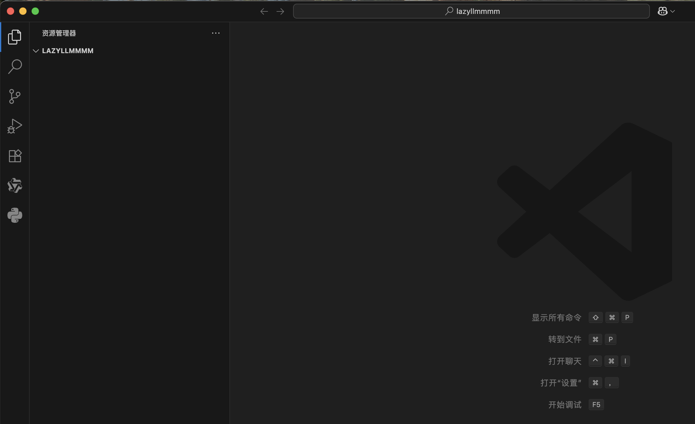

## 进阶玩法：使用 uv 管理 LazyLLM

---

uv 是一个统一的 Python 包和项目管理工具，能够**针对不同的项目指定特定的 Python 版本**，同时**针对不同的项目设定单独的包管理环境**，自动解决软件包安装**依赖冲突**，自动**同步项目运行环境**。如果你像我一样，电脑里有一堆 Python 项目，各种版本各种依赖乱成一团，强烈建议试试 uv 这个工具。它能给每个项目创建独立的环境，再也不用担心依赖冲突了：

```bash
# macOS系统输入以下命令安装
curl -LsSf https://astral.sh/uv/install.sh | sh

# Windows系统用户输入以下命令安装
powershell -ExecutionPolicy ByPass -c "irm https://astral.sh/uv/install.ps1 | iex"
```

安装之后，可以通过`uv help`命令检查是否安装成功：

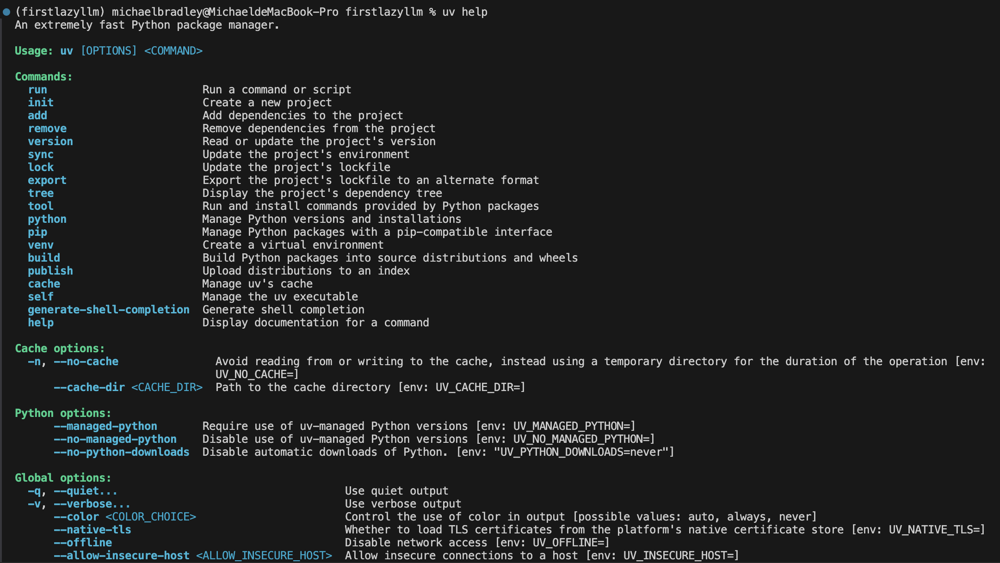

打开命令行界面，输入`uv init firstlazyllm`命令，uv 会新建一个名为`firstlazyllm`的空项目文件夹。然后使用 Visual Studio Code 打开`firstlazyllm`文件夹，文件夹内容如下图所示：

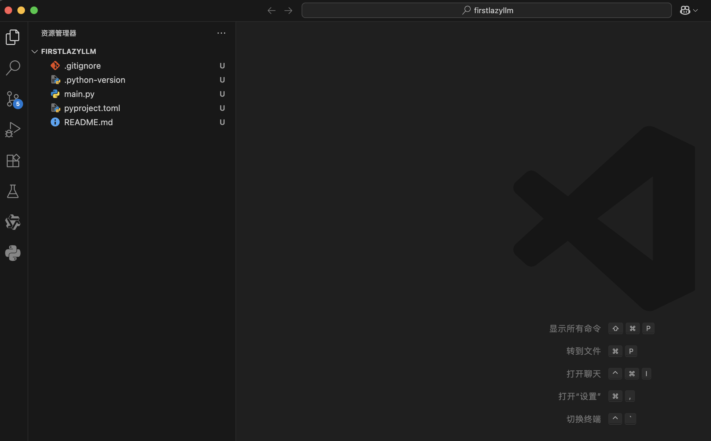

点击**终端——新建终端**，输入`uv venv --python 3.12.0`命令，uv 会向**当前项目指定使用**版本为 3.12.0 的 Python 虚拟环境。输入以下命令激活虚拟环境，激活成功后，**终端前面会新增项目名，表示正在使用项目内的虚拟环境**：

```bash
# macOS系统输入以下命令激活虚拟环境
source .venv/bin/activate

# Windows系统用户输入以下命令激活虚拟环境
.\.venv\Scripts\activate
```

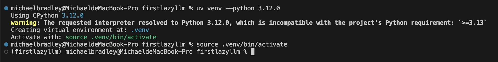

输入`uv add lazyllm`命令，uv 会**多线程下载安装**lazyllm 所需要的资源，并添加到当前虚拟环境内。

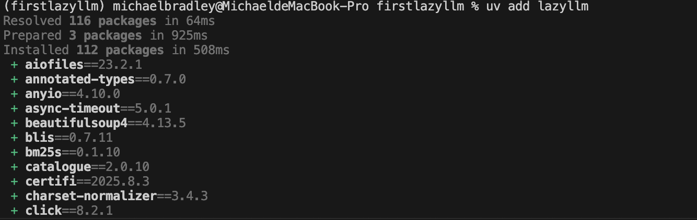

打开`pyproject.toml`文件，如果`dependencies`字段出现`lazyllm`字样，说明安装成功。

‍
