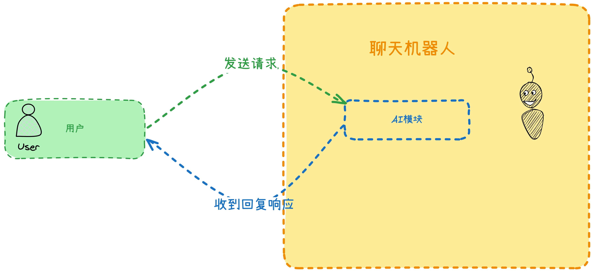
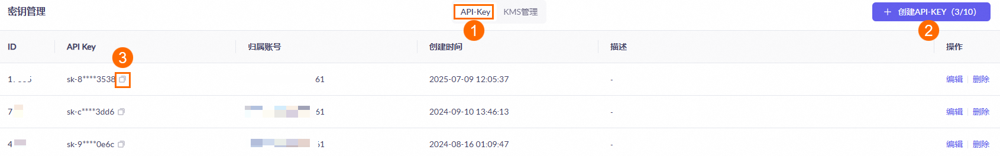
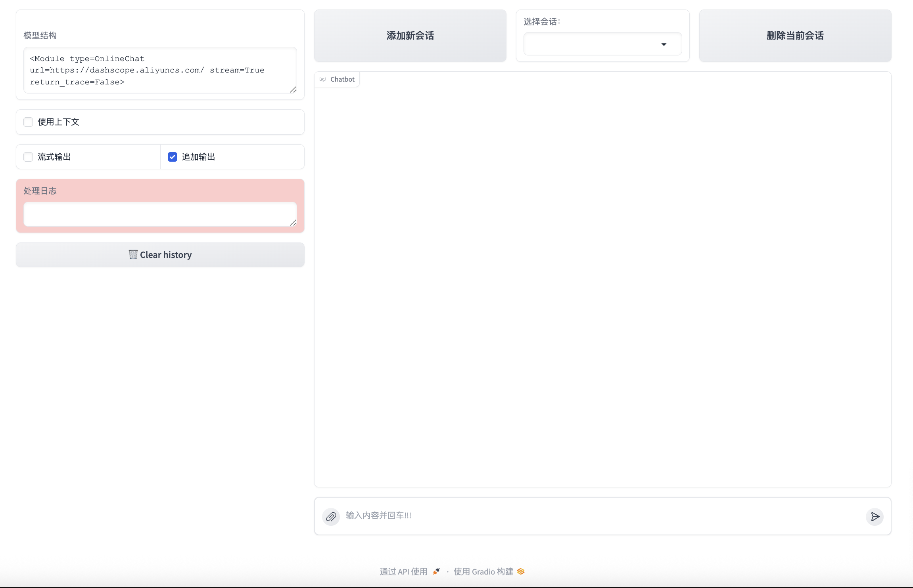
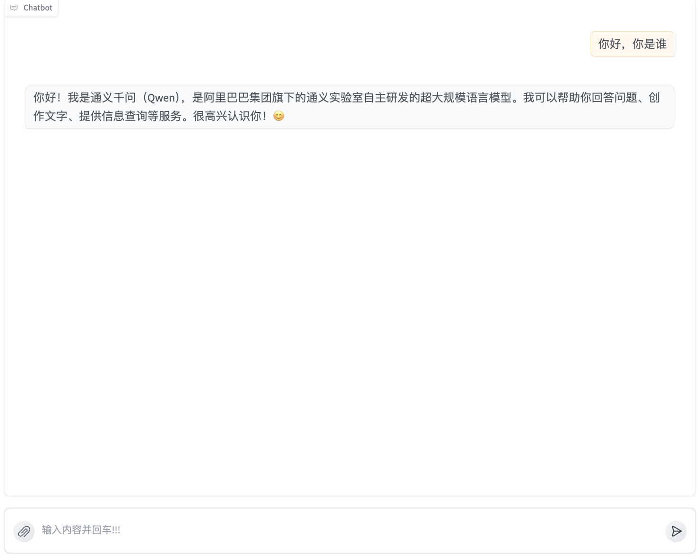
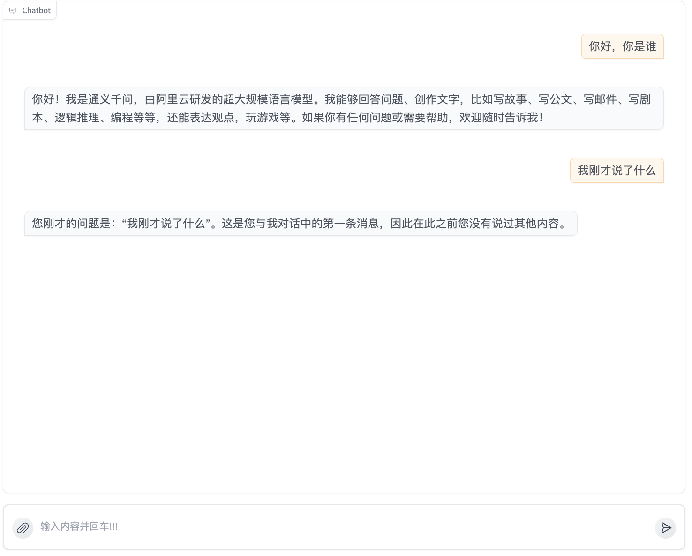
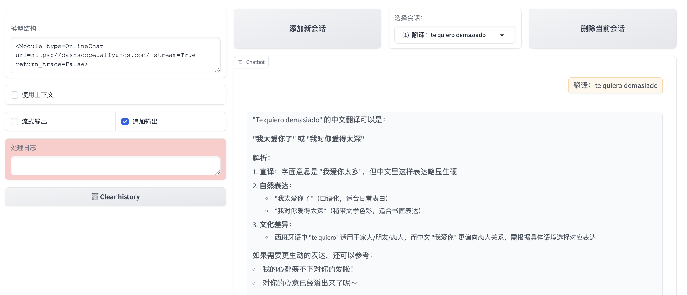

# 第二节 构建你的第一个聊天机器人

上一节内容我们把 LazyLLM 安装好了，Python 也安装好了，为了让大家**快速上手 Agent 开发**，本节内容我们从最简单的聊天机器人开始：



大致的交互逻辑如上图所示：**聊天机器人内置 AI 模块，用户向 AI 模块发送请求，AI 收到用户的请求产生响应**。

在正式开始之前，**打开 Visual Studio Code 新建一个空项目，并且安装好 LazyLLM**，接下来带大家四步实现这个聊天机器人。

## 第一步：阿里云百炼平台申请通义千问大模型访问权限

这步其实挺关键的，没有 API 啥都干不了。

打开[阿里云百炼平台官方网站](https://bailian.console.aliyun.com/)，点击右上角的**立即开通，注册阿里云账号领取大模型免费 tokens，可以支付宝或淘宝扫码直接使用。** 新用户有免费额度，够咱们玩好久了。


如果开通服务时显示“您尚未进行实名认证”，别慌，点击[这个实名认证链接](https://myaccount.console.aliyun.com/certificate)去认证下，几分钟就好。我当时就是在这耽误了一会儿。

完成实名认证后，前往[密钥管理](https://bailian.console.aliyun.com/?tab=model#/api-key)页面，看到**API-Key**那个标签了吗（下图 ① 的位置），点"**创建 API-KEY**"（② 的位置）：



在**创建 API-KEY**弹窗中，选择 API Key 的**归属账号**及**归属业务空间**，填写**描述信息**，并单击**确定**。

- **归属账号：就选你自己的账号**
- **归属业务空间：默认就行，别瞎改**
- **描述**：随便写点啥，我写的"测试用"

点击 API Key 旁的**image 图标**（上图位置 ③）即可获取到我们需要的 API Key。

## 第二步：导入 LazyLLM 模块

在项目文件夹下新建一个`main.py`的文件，输入以下内容并保存（`ctrl`+`s`）：

```python
import lazyllm
```

没啥好说的，要用人家的功能，先`import`进来呗。

## 第三步：使用通义千问模型

接下来是重头戏了，在`main.py`的文件下继续输入以下内容并保存：

```python
llm = lazyllm.OnlineChatModule(
    source="qwen",	# 指定模型来源是通义千问
    model="qwen-plus-latest",  # 通义千问的模型名
    api_key="sk-这里填写你申请的key",	# 调用模型的验证密钥，这里填写你自己的
)
```

这个`OnlineChatModule`是 LazyLLM 用来管理创建目前市面上**公开的大模型平台访问模块**，支持好多平台呢——OpenAI、qwen、Kimi 啥的都行。咱们用的是通义千问，所以`source`写"qwen"，同时还需要填写这样几个参数：

- **`model`** (`str`) – 指定**要访问的模型名称** ，**如果不写**默认为 `gpt-3.5-turbo(openai)` / `SenseChat-5(sensenova)` / `glm-4(glm)` / `moonshot-v1-8k(kimi)` / `qwen-plus(qwen)` / `mistral-7b-instruct-v0.2(doubao)`，这里我们填写`qwen-plus-latest`以体验通义千问的最新模型效果
- **`api_key`** (`str`) – 指定**访问密钥**，这里填写刚刚在阿里云百炼平台申请的密钥

## 第四步：启动聊天机器人

在`main.py`的文件下继续输入以下内容并保存：

```python
lazyllm.WebModule(llm, port=23466).start().wait()
```

这里`WebModule`就是给咱们的模型套了个 Web 界面的壳子。端口我习惯用 23466，好记。你要是不指定端口，系统会自动在 20500-20799 之间找个空的。

- `llm`是你要启动的服务，不启动之前写的聊天机器人，Web 界面就真的只剩下一个界面了。

- `start` 是启动的意思。如果 `start` 一旦执行，就会把整个应用中所有模块的部署都跑一遍。 这里`OnlineChatModule`和 `WebModule`会调用远程的 `qwen-plus-latest` 模型，并启动一个 Web 客户端。
- `wait` 用于在客户端启动后就让它保持一直开启而不关闭。

点击**终端——新建终端，** 输入以下命令运行聊天机器人：

```python
python main.py
```

部署完成并且客户端启动后，LazyLLM 会在终端**打印可访问的 URL**，如下面的内容所示：

```bash
(firstlazyllm) michaelbradley@MichaeldeMacBook-Pro firstlazyllm % uv run main.py
Running on local URL:  http://0.0.0.0:23466

To create a public link, set `share=True` in `launch()`.
72532: 2025-08-28 15:26:10 lazyllm SUCCESS: (lazyllm.tools.webpages.webmodule:455) LazyLLM webmodule launched successfully: Running on: http://0.0.0.0:23466, local URL: http://127.0.0.1:23466
```

打开`http://127.0.0.1:23466`，界面如下图所示：



在下方的输入框随便输入一些内容，即可体验你自己搭建的聊天机器人啦：



## 大模型为什么记不住我先前说了什么？——使用上下文

也许你可能会发现这个问题，**为什么我问 AI“我之前说了什么”，结果 AI 没记住我说的话呢**？



我第一次用的时候也懵了，问它"我刚才说了啥"，它一脸茫然。后来发现是**没开上下文功能**。

这个功能我们只需要修改`WebModule`里的一处内容即可：

```python
lazyllm.WebModule(llm, port=23466, history=[llm]).start().wait()
```

这里`history=[llm]`的意思是一个记忆列表，列表中指定了把上下文传给谁。这里是传给了`llm`，`history` 的指定是开启上下文的第一步。在使用客户端的时候，还要**开启上下文功能**，才能保证记忆功能打开。如下：


## 我能不能隐藏我的 api_key？——环境变量

细心的你会问这样的问题，我想把代码分享给其他人，但是我不希望我的 api_key 明晃晃显示在代码里面，能不能隐藏这个 api_key 呢？

当然可以。这里我们需要导入一个新的 Python 模块——`os`，同时修改这里的内容：

```python
llm = lazyllm.OnlineChatModule(
    source="qwen",
    model="qwen-plus-latest",  # 使用一个标准的模型名称
    api_key=os.getenv("QWEN_API_KEY"),
)
```

与之前相比，现在`api_key`变成了通过**系统环境变量**获取，也就是`os.getenv("QWEN_API_KEY")`，那么该怎么设置`api_key`呢？

点击**终端——新建终端，** 输入以下命令设置环境变量，按下`enter`键执行：

```python
export QWEN_API_KEY=sk-这里填写你的key
```

然后再运行项目，同样执行之前的操作，你会发现，没问题！

## 我能不能换一个模型？——阿里云百炼找

你也许会问，我能不能体验一下其他模型，当然可以，而且好消息是，你只需要修改`OnlineChatModule`里的`model`参数就可以了

[阿里云百炼模型广场](https://bailian.console.aliyun.com/?tab=model#/model-market)提供了不同的模型供你测试，那么`model`参数该怎么填呢？点击“查看详情”就能找到了。


我们换成`qvq-max-latest`这个模型试一下：

> 翻译：te quiero demasiado



## 能不能生成一张图片呢？

当然可以，这个问题我们在接下来的内容中讲到。

## 本节完整代码

```python
import lazyllm

# 使用在线模型
llm = lazyllm.OnlineChatModule(
    source="qwen",
    model="qwen-plus-latest",  # 使用一个标准的模型名称
    api_key='sk-这里填写你申请的key'
)

lazyllm.WebModule(llm, port=23466).start().wait()
```
