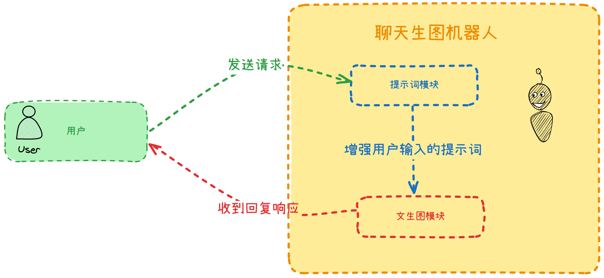
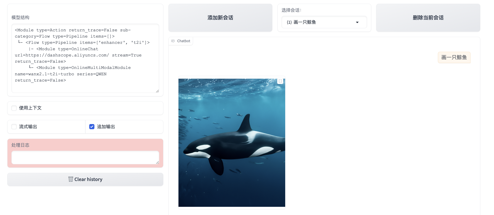

# 第三节 代码的工作流什么样？

相信你之前体验过在一张无限画布上绘制工作流的感觉。说实话，第一次在那种无限画布上拖拽节点构建工作流的时候，我就在想——**这玩意儿背后的代码到底长什么样**？今天咱们就来揭开这个谜底。

还记得上回咱们搞的那个聊天机器人吗？当时我故意留了个悬念：

> **能不能生成一张图片**？

今天就来实现它！



整个思路其实挺直观的——**把原来的 AI 模块拆成两部分**：一个负责**优化提示词**，另一个**专门生成图片**。用户说"**画一只小猪**"，第一个模块就把这句话**翻译并扩展**成图像 AI 能理解的详细描述，然后第二个模块根据这个描述生成图片。就像是请了个翻译，把你的中文需求转换成 AI 画师能理解的"行话"。

开始之前，先把环境准备好——**打开 Visual Studio Code 新建一个空项目**，把 LazyLLM 装上。接下来咱们一步步来。

## 导入 LazyLLM 模块

在项目文件夹下新建一个`main.py`的文件，输入以下内容并保存（`ctrl`+`s`）：

```python
import lazyllm
from lazyllm import pipeline
```

这里和之前的代码相比多了一行`from lazyllm import pipeline`，这是 LazyLLM 里专门用来**串联不同模块**的工具。你可以把它想象成**管道**，让数据**按顺序流过**不同的处理环节。

## 构建提示词模块

在`main.py`的文件下继续输入以下内容并保存：

```python
# Part1: 聊天机器人模块 - 用于优化提示词
prompt_enhancer = lazyllm.OnlineChatModule(
    source="qwen",
    model="qwen-plus-latest",  # 使用一个标准的模型名称
    api_key='sk-这里填写你申请的key'
)

# 为提示词优化器添加提示词模板
enhancer_prompt = """You are a drawing prompt word master who can convert any Chinese content entered by the user into English drawing prompt words. In this task, you need to convert any input content into detailed and rich English drawing prompt words that can be used for AI art generation.

Please follow these guidelines:
1. Translate the Chinese input into English
2. Expand the prompt with rich descriptive details
3. Include artistic style, lighting, colors, and other relevant elements
4. Structure the response clearly for the next processing step

Example:
Input: 画一只小猪
Output: A cute little pig, chubby and adorable with a round pink body, curly tail, small pointed ears, and a snout with two nostrils. The pig has sparkling eyes with long eyelashes, standing on four short legs with tiny hooves. Soft pastel pink color palette, friendly expression, cartoon-style illustration, clean simple background"""

# 提示词优化器使用上面的提示词模版完成任务
prompt_enhancer_with_template = prompt_enhancer.prompt(
    lazyllm.ChatPrompter(enhancer_prompt)
)
```

这段代码比较长，其实就三件事：**初始化一个 AI 助手，告诉它该干什么（把"画一只小猪"变成详细的英文描述），然后把这个任务指令装配上去。**

第一部分`prompt_enhancer`实际上就是第二节我们写过的内容，仔细看一下是不是这样。

第二部分`enhancer_prompt`是提示词模块的**核心功能**。也就是把用户简单的输入`画一只小猪`，增强成符合文生图模型口味的`A cute little pig, chubby and adorable with a round pink body, curly tail, small pointed ears, and a snout with two nostrils. The pig has sparkling eyes with long eyelashes, standing on four short legs with tiny hooves. Soft pastel pink color palette, friendly expression, cartoon-style illustration, clean simple background`。

第三部分`prompt_enhancer_with_template`是在第一部分`prompt_enhancer`的基础上，让这个模块**使用第二部分的提示词**工作。其中传进去的`lazyllm.ChatPrompter(enhancer_prompt)`就起到了这个作用。

我特别喜欢这个设计——你给 AI 一个**简单的中文输入**，它能**自动扩展**成包含艺术风格、光线、色彩等各种细节的**专业提示词**。比如"画一只小猪"会变成描述**小猪的粉红色身体、卷曲的尾巴、闪亮的眼睛等等**一大段详细描述。

## 构建文生图模块

在`main.py`的文件下继续输入以下内容并保存：

```python
# Part2: 文生图模块 - 使用通义万象模型进行图像生成
text_to_image_module = lazyllm.OnlineMultiModalModule(
    source="qwen",
    model="wanx2.1-t2i-turbo",
    api_key="sk-这里填写你申请的key",
    function="text2image",
)

# 为文生图模型添加特定提示词，明确要求生成图像
image_generation_prompt = """Based on the following detailed prompt, please generate an image:

{input}

Please create a high-quality image that matches this description exactly.
Include all the details mentioned in the prompt, such as colors, style, lighting, and composition.
Make sure the image is visually appealing and accurately represents the description provided."""

# 文生图模块使用上面的文生图提示词完成任务
text_to_image_with_template = text_to_image_module.prompt(
    lazyllm.ChatPrompter(image_generation_prompt)
)
```

这段代码同样也是三部分内容：

第一部分`text_to_image_module`使用了`OnlineMultiModalModule`模块，`OnlineMultiModalModule` 是 LazyLLM 用来**管理创建多模态大语言模型**的模块，根据传入的参数创建相应功能的模型实例。它通过 `function` 参数来决定创建哪种类型的模型：当 `function="stt"` 时，创建语音转文字模型，当 `function="tts"` 时，创建文字转语音模型，当 `function="text2image"` 时，创建文字生成图像模型。

**由于我们的任务是文生图**，所以`function`参数应该使用`text2image`。同样，`model`也需要更换为能够文生图的`wanx2.1-t2i-turbo`。

第二部分`image_generation_prompt`的作用是**规定模型是用于文生图任务**。

第三部分`text_to_image_with_template`也是在第一部分`text_to_image_module`的基础上，让这个模块**使用第二部分的提示词**工作。其中传进去的`lazyllm.ChatPrompter(image_generation_prompt)`就起到了这个作用。

至此，文生图功能用三部分内容完成实现：**初始化 AI**——**构建文生图任务的提示词模版**——**组装模版**

那么，我们如何把这两大模块组装到一起呢？

## 组装两大模块并以 web 服务上线

在`main.py`的文件下继续输入以下内容并保存：

```python
# 创建 pipeline
with pipeline() as ppl:
    ppl.enhancer = prompt_enhancer_with_template
    ppl.t2i = text_to_image_with_template

# 创建 WebModule并启动服务
web = lazyllm.WebModule(
    ppl,
    port=23466,
    history=[ppl.enhancer],  # 只为提示词优化器保留历史记录
).start().wait()
```

这个`pipeline`的设计真的很优雅——**用 with 语句创建上下文**，然后**给 pipeline 添加属性**就能定义执行顺序。数据会先经过`enhancer`优化提示词，再流向`t2i`生成图片。

`Pipeline`类是一个处理阶段的线性序列，其中一个阶段的输出成为下一个阶段的输入。它支持在最后一个阶段之后添加后续操作。

在上面的代码片段中，我们使用 `pipeline` 上下文管理器来构建了我们的控制流程。

先执行`prompt_enhancer_with_template`，增强用户输入。之后执行`text_to_image_with_template`，完成生图任务。如果希望整个 pipeline 生效，那就需要**给 ppl 添加属性**。也就是`ppl.enhancer`和`ppl.t2i`起到的作用。

创建 pipeline 的**本质，相当于两大模块变成了一个模块。**

`WebModule`我们在上一节的内容中接触过了，`ppl`是我们要启用的服务，`port`是服务占用的端口，`history`指定上下文传给了**最开始的增强提示词模块**。

剩下来的内容和第二节一样啦，点击**终端——新建终端，输入**`python main.py`即可运行我们的工作流了。运行起来后，在浏览器里输入"画一只鲸鱼"试试——你会发现左上角的模型结构图清楚地展示了整个工作流的两个组件。整个过程就像**搭积木**一样，**每个模块各司其职**，通过 pipeline 串起来就成了一个完整的系统。左上角的“模型结构”也清楚的显示了整个工作流使用到的两个组件`enhancer`和`t2i`：



这种模块化的设计思路其实挺值得借鉴的——**把复杂的任务拆解成独立的模块**，每个模块专注做好一件事，然后通过 pipeline 灵活组合。以后想加新功能，比如加个图片风格转换模块，直接往 pipeline 里塞就行了。

## 本节完整代码

```python
import lazyllm
from lazyllm import pipeline

# Part1: 聊天机器人模块 - 用于优化提示词
prompt_enhancer = lazyllm.OnlineChatModule(
    source="qwen",
    model="qwen-plus-latest",  # 使用一个标准的模型名称
    api_key='sk-这里填写你申请的key'
)

# 为提示词优化器添加提示词模板
enhancer_prompt = """You are a drawing prompt word master who can convert any Chinese content entered by the user into English drawing prompt words. In this task, you need to convert any input content into detailed and rich English drawing prompt words that can be used for AI art generation.

Please follow these guidelines:
1. Translate the Chinese input into English
2. Expand the prompt with rich descriptive details
3. Include artistic style, lighting, colors, and other relevant elements
4. Structure the response clearly for the next processing step

Example:
Input: 画一只小猪
Output: A cute little pig, chubby and adorable with a round pink body, curly tail, small pointed ears, and a snout with two nostrils. The pig has sparkling eyes with long eyelashes, standing on four short legs with tiny hooves. Soft pastel pink color palette, friendly expression, cartoon-style illustration, clean simple background"""

# 提示词优化器使用上面的提示词模版完成任务
prompt_enhancer_with_template = prompt_enhancer.prompt(
    lazyllm.ChatPrompter(enhancer_prompt)
)

# Part2: 文生图模块 - 使用通义万象模型进行图像生成
text_to_image_module = lazyllm.OnlineMultiModalModule(
    source="qwen",
    model="wanx2.1-t2i-turbo",
    api_key="sk-这里填写你申请的key",
    function="text2image",
)

# 为文生图模型添加特定提示词，明确要求生成图像
image_generation_prompt = """Based on the following detailed prompt, please generate an image:

{input}

Please create a high-quality image that matches this description exactly.
Include all the details mentioned in the prompt, such as colors, style, lighting, and composition.
Make sure the image is visually appealing and accurately represents the description provided."""

# 文生图模块使用上面的文生图提示词完成任务
text_to_image_with_template = text_to_image_module.prompt(
    lazyllm.ChatPrompter(image_generation_prompt)
)

# 创建 pipeline
with pipeline() as ppl:
    ppl.enhancer = prompt_enhancer_with_template
    ppl.t2i = text_to_image_with_template

# 创建 WebModule并启动服务
web = lazyllm.WebModule(
    ppl,
    port=23466,
    history=[ppl.enhancer],  # 只为提示词优化器保留历史记录
).start().wait()
```
