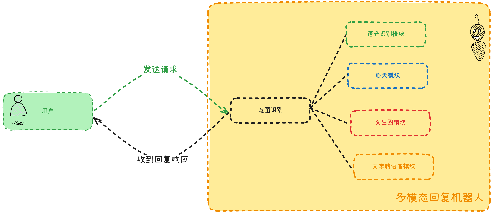
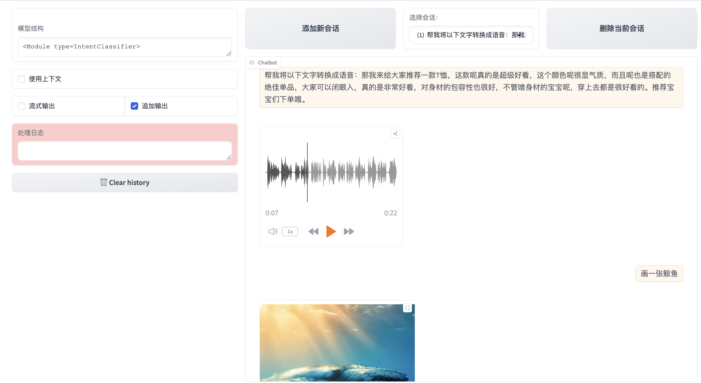

# 第四节 多模态聊天

记得上次我们搞定了那个文生图工作流吗？挺有意思的。

这回我想玩个更大的——**把聊天、画图、语音合成这些功能全部整合到一个系统里**。你想聊天就聊天，想画图就画图，想听语音就转语音，一个机器人全搞定：



大致的交互过程如上图所示：整个系统的核心其实是个**意图识别**的模块。就像个智能调度员，你说句话，**它先判断你想干嘛**，然后把任务分配给对应的模块去处理。比如你说"**画一只猫**"，它识别出**你想画图**，就调用**文生图**；你说"**今天天气真好**"，它知道**你想聊天**，就**启动对话模块**。

废话不多说，咱们直接开干。老规矩，**打开 Visual Studio Code 新建一个空项目**，LazyLLM 装好，接下来带领大家一点一点拆解代码。

## 导入 LazyLLM 模块

在项目文件夹下新建一个`main.py`的文件，输入以下内容并保存（`ctrl`+`s`）：

```python
import lazyllm
from lazyllm import pipeline
from lazyllm.tools import IntentClassifier
```

这里和之前的代码相比多了一行`from lazyllm.tools import IntentClassifier`——这就是我们的**调度员**，`IntentClassifier`负责识别用户意图并分配任务。

## 构建基础意图识别实例

在`main.py`的文件下继续输入以下内容并保存：

```python
base = lazyllm.OnlineChatModule(
    source="qwen",
    model="qwen-plus-latest",
    api_key="sk-这里填写你申请的key",
)

# 使用 with 语句创建一个意图分类器实例
# 意图分类器会根据用户输入的内容判断其意图，并分发到相应的处理模块
with IntentClassifier(base) as ic:
```

**意图识别**说白了也是调用 AI 模型来判断。所以我们先创建一个基础的聊天模块，然后用`IntentClassifier`包装一下，它就变成了一个能识别意图的智能调度系统。

## 构建功能实现模块

在`main.py`的文件下继续输入以下内容并保存：

```python
    # 定义聊天意图的处理方式
    ic.case["聊天", base]

    # 定义画图意图的处理方式
    ic.case[
        "画图",
        pipeline(
            # 共享基础模型并设置绘图提示词
            base.share().prompt(
                "现在你是一位绘图提示词大师，能够将用户输入的任意中文内容转换成英文绘图提示词，在本任务中你需要将任意输入内容转换成英文绘图提示词，并且你可以丰富和扩充提示词内容。"
            ),
            # 使用通义万相文生图模型生成图像
            lazyllm.OnlineMultiModalModule(
                source="qwen",  # 使用通义千问系列模型
                model="wanx2.1-t2i-turbo",  # 使用 wanx2.1-t2i-turbo 文生图模型
                api_key="sk-这里填写你申请的key",  # API 密钥
                function="text2image",  # text2image 表示文本转图像功能
            ),
        ),
    ]

    # 定义文字转语音意图的处理方式
    # 当识别为"文字转语音"意图时，使用通义千问的文字转语音模型
    ic.case[
        "文字转语音",
        lazyllm.OnlineMultiModalModule(
            source="qwen",  # 使用通义千问模型
            model="qwen-tts",  # 使用 qwen-tts 文字转语音模型
            api_key="sk-这里填写你申请的key",  # API 密钥
            function="tts",  # tts 表示 text to speech，即文字转语音功能
        ),
    ]
```

这部分代码其实挺有意思的。`ic.case`就像是在设置一个个开关：

- 识别到**聊天**意图，直接用**基础模型回复**
- 识别到**画图**意图，**先优化提示词再生成图片**（还记得上节课的内容吗？）
- 识别到**文字转语音**，调用 TTS 模型把文字变成语音

我特别喜欢这里的`base.share()`设计——共享同一个基础模型，**避免重复创建，省资源还保持一致性**。

## 组装模块并以 web 服务上线

在`main.py`的文件下继续输入以下内容并保存：

```python
# 程序入口点：启动 Web 服务
# 创建 WebModule 并启动服务
# 参数说明：
# ic: 指定处理逻辑为上面定义的意图分类器
# history=[base]: 启用对话历史记录功能，使用 base 模型管理历史
# audio=True: 启用音频功能，支持语音输入和输出
# port=23466: 指定服务运行在 23466 端口
lazyllm.WebModule(ic, history=[base], port=23466).start().wait()
```

`WebModule`我们在之前的内容中接触过了，`ic`**整个意图识别模块**是我们要启用的服务，`port`是服务占用的端口，`history`指定上下文传给了**最开始的基础模型**。

剩下来的内容和第二节一样啦，点击**终端——新建终端，输入**`python main.py`即可运行我们的多模态聊天机器人了。大家可以尝试在输入框中输入“画一只鲸鱼”以及“帮我将文字转换成语音”看一下效果，同样的普通聊天也是生效的。左上角的“模型结构”也清楚的显示了整个工作流使用到的`IntentClassifier`：



这种模块化设计真的很灵活。今天加个语音功能，明天想加个视频生成，后天再来个代码执行……**只要往\*\***`ic.case`\***\*里加就行**。每个功能独立运作，互不干扰，维护起来也方便。

跑起来试试吧，你会发现这个多模态聊天机器人比单一功能的有意思多了。用户体验上也更自然——**不用切换不同的工具**，一个入口解决所有需求。

顺便说一句，**这种意图识别+功能调度的架构，其实是很多智能助手的基本套路**。掌握了这个，你基本就理解了大部分 AI 应用的核心架构。

到这里，我们的入门篇就正式结束啦。接下来带大家进阶学习 RAG 的内容。

## 本节完整代码

```python
# 导入 lazyllm 库，这是一个大语言模型开发工具包
import lazyllm

# 从 lazyllm 中导入 pipeline 模块，用于构建处理流程
from lazyllm import pipeline

# 从 lazyllm.tools 中导入 IntentClassifier 模块，用于意图识别和分类
from lazyllm.tools import IntentClassifier

# 创建基础的在线聊天模型实例（大语言模型）
# source="qwen" 表示使用通义千问系列模型
# model="qwen-plus-latest" 表示使用 qwen-plus 的最新版本
# api_key 是访问模型服务所需的认证密钥
base = lazyllm.OnlineChatModule(
    source="qwen",
    model="qwen-plus-latest",
    api_key="sk-这里填写你申请的key",
)

# 使用 with 语句创建一个意图分类器实例
# 意图分类器会根据用户输入的内容判断其意图，并分发到相应的处理模块
with IntentClassifier(base) as ic:
    # 定义聊天意图的处理方式
    # 当识别为"聊天"意图时，使用基础模型进行处理
    ic.case["聊天", base]

    # 定义画图意图的处理方式
    # 当识别为"画图"意图时，先通过基础模型将中文转换为英文绘图提示词，再调用文生图模型
    ic.case[
        "画图",
        pipeline(
            # 共享基础模型并设置绘图提示词
            base.share().prompt(
                "现在你是一位绘图提示词大师，能够将用户输入的任意中文内容转换成英文绘图提示词，在本任务中你需要将任意输入内容转换成英文绘图提示词，并且你可以丰富和扩充提示词内容。"
            ),
            # 使用通义万相文生图模型生成图像
            lazyllm.OnlineMultiModalModule(
                source="qwen",  # 使用通义千问系列模型
                model="wanx2.1-t2i-turbo",  # 使用 wanx2.1-t2i-turbo 文生图模型
                api_key="sk-这里填写你申请的key",  # API 密钥
                function="text2image",  # text2image 表示文本转图像功能
            ),
        ),
    ]

    # 定义文字转语音意图的处理方式
    # 当识别为"文字转语音"意图时，使用通义千问的文字转语音模型
    ic.case[
        "文字转语音",
        lazyllm.OnlineMultiModalModule(
            source="qwen",  # 使用通义千问模型
            model="qwen-tts",  # 使用 qwen-tts 文字转语音模型
            api_key="sk-这里填写你申请的key",  # API 密钥
            function="tts",  # tts 表示 text to speech，即文字转语音功能
        ),
    ]


# 程序入口点：启动 Web 服务
# 创建 WebModule 并启动服务
# 参数说明：
# ic: 指定处理逻辑为上面定义的意图分类器
# history=[base]: 启用对话历史记录功能，使用 base 模型管理历史
# audio=True: 启用音频功能，支持语音输入和输出
# port=23466: 指定服务运行在 23466 端口
lazyllm.WebModule(ic, history=[base], port=23466).start().wait()
```
