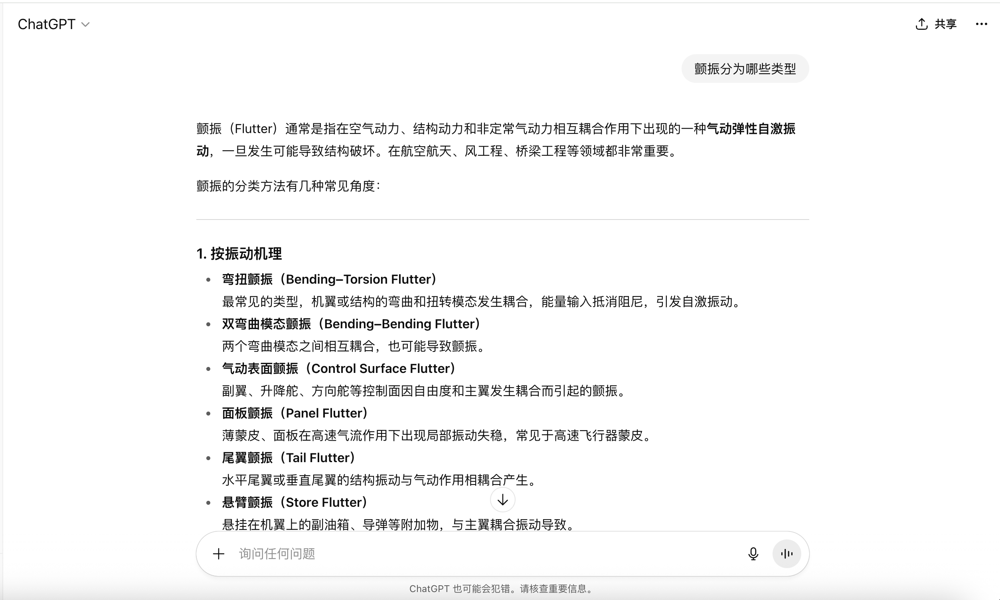
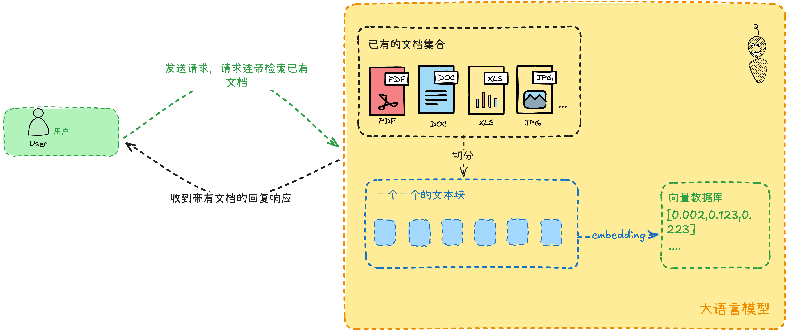
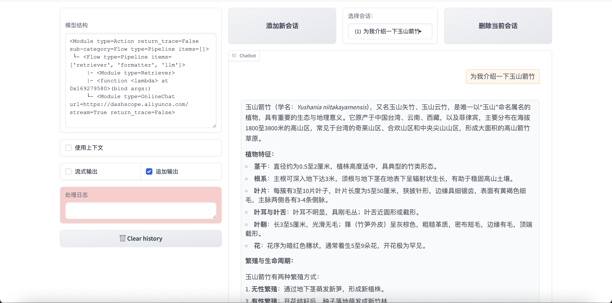
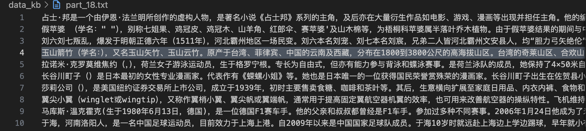

# 第一节 RAG 的基础概念和实现

看到这里的你，相信已经看懂了 LazyLLM 的入门篇，也能够跟着后面的完整项目制作属于自己的机器人了。

接下来，我们从**RAG**（\*Retrieval-augmented generation，\***_检索增强生成_**）开始，带大家一起从头开始，彻底搞懂 RAG。

## 从大模型到 RAG

你可能会问，要了解 RAG 为什么要从大模型开始。我来讲一下我前几天发生的事情。

前几天我用 ChatGPT 问了个关于飞机颤振的问题——这可是航空专业的基础知识。

我问它"颤振分为哪些类型"，结果它给我扯了一大堆，什么结构颤振、气动颤振的，听起来挺专业，但完全没答到点子上。



后来我才发现，原来正确答案应该是"机翼的弯扭颤振和副翼的弯曲颤振"——这是我从《飞机原理与构造》这本专业教材里找到的。

有意思的是，当我把书籍的 PDF 文件上传给它后，嘿，它立马就给出正确答案了！

这让我突然意识到，**这些看起来无所不知的大模型，其实也有它们的"知识盲区"。**

这就像是一个学霸参加考试，平时成绩很好，基础知识扎实，但遇到一些特别专业或者最新的内容时，光靠死记硬背的知识还真不够用。特别是现在信息更新这么快，今天的前沿可能明天就过时了。

而且你想想看，站在企业的角度，**企业里那么多文档资料，几千几万份的，模型哪能全记住啊？**

这时候 RAG 就派上用场了——它不需要把所有东西都塞进模型的"脑子"里，而是需要的时候再去翻资料。这个思路其实挺聪明的。

说到大模型的问题，最让我头疼的就是**它们有时候会"一本正经地胡说八道"** 。专业点说这叫 **"幻觉"** 问题。

我记得有一次问它一个技术细节，它回答得头头是道，引经据典的，结果我一查，根本没这回事！这种**事实性错误和逻辑混乱**的问题，在实际工作中可是要命的。

RAG 的出现真的像是**给考试的学生配了一本可以实时更新的参考书**。遇到不确定的问题，先翻翻书（**检索**相关资料），然后结合自己的理解（模型能力）来回答。这样**既保证了答案有据可查，又能发挥模型的理解和表达能力**。

从我个人使用体验来看，RAG 确实解决了几个关键痛点：

- 一是让**回答更可靠**了，有真实数据支撑。
- 二是**能处理最新信息**，不再局限于训练时的数据。
- 三是对企业来说，**敏感数据不用放进模型里训练**，安全性更高。

不过说真的，这个技术还在发展中，有时候检索的内容不够精准，或者检索和生成之间的衔接还不够自然。但整体来说，RAG 确实让大模型在实际应用中变得更加"接地气"了。

## RAG 的基本流程

RAG 的工作原理你看这张图就很清楚了：用户提个问题，系统不是直接让大模型硬答。大模型首先会先去知识库里"翻翻书"——从一个庞大的文档集合中检索出相关的信息，这些检索到的信息随后会被用于指导生成过程，从而显著提高生成文本的质量和准确性。系统接收一个用户 Query， 首先通过**检索器**（Retriever）从**外部文档**（Document）中检索出与给定 Query 相似的内容，然后将其与 Query 一同输入到**大语言模型**（LLM） ，大语言模型给出最终答案。

这个过程说起来简单，做起来还挺有讲究的。



RAG 的离线工作流程可以归纳成以下三步：

- 文档读取和解析（Reader）：第一步是文档处理，这步看起来简单，实际上坑最多。你想啊，不管是个人还是企业，你的电脑里一定什么文档都有——**PDF、Word、PPT，甚至还有扫描件**。如果你使用普通的解析工具，结果表格全乱了，图片里的文字也提取不出来。我记得有个财务报表的 PDF，里面表格特别复杂，折腾了我两天才搞定。后来换了 MinerU 这类专门的工具，效果才好起来。

- 分块和向量化（Transform and Vectorize）：这步其实挺有技术含量的。文档**不能整个扔进去，得切成合适的小块**——太大了**检索不精准**，太小了又**丢失上下文**。当然了，根据不同文档类型采用不同策略效果最好。比如技术文档按段落切，合同文件按条款切。向量化这块，说白了就是把文字变成数字，让机器能理解和比较。

- 索引和存储（Indexing and Store）：利用**向量数据库**或其他高效的**向量检索工具**，将处理后的文本数据进行高效的**存储和索引**。

整个流程跑通后，效果确实不错。用户问问题时，系统会先找到最相关的几段内容，然后把这些内容和原始问题一起喂给大模型，让它基于这些"参考资料"来回答。这样回答既准确又有依据，不会出现之前那种"胡编乱造"的情况了。

不过说实话，要把 RAG 做好，细节调优很重要。比如怎么判断相关性、检索多少条内容合适、如何处理检索结果的排序等等，这些都需要不断迭代优化。我们接下来就会带大家实现一个最小的 RAG 流程，在后续的课程中，我们也会给出如何迭代提高整个 RAG 流程。

## 实践：使用 LazyLLM 构建一个最小的 RAG 系统

RAG 在 LazyLLM 中的基本组件我们已经介绍完成了，下面我就可以用这几部分关键组件搭建完整的 RAG 系统了。

但是在此之前，我们首先需要选择一些文档作为 RAG 的语料库，下面我们将从[cmrc2018](https://huggingface.co/datasets/hfl/cmrc2018)原始数据集开始，为大家讲解如何基于此数据集构建我们的 RAG 知识库。在接下来的教程中，我们将介绍 RAG 改进和优化的各种方法，若无特殊说明，将始终使用此知识库。

### 下载 cmrc2018 数据集

```python
dataset = load_dataset('cmrc2018', cache_dir='./datasets') # 指定下载路径为当前目录下的datasets文件夹
print(dataset)
```

这里数据集的基本格式如下：

> DatasetDict({
> train: Dataset({
> features: ['id', 'context', 'question', 'answers'],
> num_rows: 10142
> })
> validation: Dataset({
> features: ['id', 'context', 'question', 'answers'],
> num_rows: 3219
> })
> test: Dataset({
> features: ['id', 'context', 'question', 'answers'],
> num_rows: 1002
> })
> })

我翻译一下什么意思，cmrc2018 这个大数据集有**三个子数据集**。一个叫`train`，一个叫`validation`，另一个叫`test`。

其中，`train`这个数据集有 10142 条数据，`validation`有 3219 条数据，`test`是 1002 条数据。数据集的结构大概是这样的：

| id               | context | question | answers |
| ---------------- | ------- | -------- | ------- |
| 用来区分唯一性用 | 正文    | 问题     | 答案    |

### 使用`test`数据集的`context`部分构建 RAG 的知识库

为了快速跑通 RAG 系统，我们选择一个数据量少一点的子数据集。考虑到每条数据中有`id`，`context`，`question`以及`answers`四个字段，我们仅使用`context`部分内容作为知识库，这样在后续评测 RAG 的效果时，我们就可以选择同一条数据当中`context`对应的`question`作为 query 输入，通过比较 RAG 中检索组件根据`question`召回的结果与 RAG 中生成组件与原本的`answers`，就可以对 RAG 系统的好坏做出评价。下面给出代码：

```python
# 构建知识库
def create_KB(dataset):
    """基于测试集中的context字段创建一个知识库，每10条数据为一个txt，最后不足10条的也为一个txt"""
    Context = []
    for i in dataset:
        Context.append(i["context"])
    Context = list(set(Context))  # 去重后获得256个语料

    # 计算需要的文件数
    chunk_size = 10
    total_files = (len(Context) + chunk_size - 1) // chunk_size  # 向上取整

    # 创建文件夹data_kb保存知识库语料
    os.makedirs("data_kb", exist_ok=True)

    # 按 10 条数据一组写入多个文件
    for i in range(total_files):
        chunk = Context[i * chunk_size : (i + 1) * chunk_size]  # 获取当前 10 条数据
        file_name = f"./data_kb/part_{i + 1}.txt"  # 生成文件名
        with open(file_name, "w", encoding="utf-8") as f:
            f.write("\n".join(chunk))  # 以换行符分隔写入文件

        print(f"文件 {file_name} 写入完成！")  # 提示当前文件已写入


create_KB(dataset["test"])  # 调用create_KB()创建知识库
# 展示其中一个txt文件中的内容
with open("data_kb/part_1.txt") as f:
    print(f.read())
```

代码比较长，我来一点一点解释含义：

- 第 2-3 行：这部分代码循环遍历 `data` 中的每个字典，提取每个字典中的 `context` 字段的值，并将其添加到 `Context` 列表中。最终，`Context` 将包含所有的 `context` 数据。
- 第 6 行：通过使用 `set()`，该行代码去除了 `Context` 中的重复项，确保每个 `context` 只出现一次。然后，使用 `list()` 将去重后的 `set` 转换回列表。
- 第 9-10 行：`chunk_size` 设置为 10，表示每个文件将包含最多 10 条 `context` 数据。为了计算需要生成多少个文件，`total_files` 通过将 `Context` 列表的长度除以 `chunk_size` 进行计算，且使用了向上取整的技巧 `(len(Context) + chunk_size - 1) // chunk_size`。这确保了即使 `Context` 的长度不是 10 的整数倍，最后一部分数据也会被单独写入一个文件。
- 第 15-20 行：将 `Context` 列表按每 10 条数据一组进行拆分，并将每组数据写入一个独立的文本文件。具体操作如下：
- `for i in range(total_files)`：循环遍历需要创建的文件数量。
- `chunk = Context[i * chunk_size : (i + 1) * chunk_size]`：从 `Context` 中获取当前批次的 10 条数据（即每个文件包含 10 条数据）。
- `file_name = f"./data_kb/part_{i+1}.txt"`：为每个文件生成一个唯一的文件名，例如 `part_1.txt`, `part_2.txt` 等。
- `with open(file_name, "w", encoding="utf-8") as f:`：以写模式打开（或创建）对应的文本文件，并确保使用 UTF-8 编码。
- `f.write("\n".join(chunk))`：将当前批次的 10 条数据通过换行符 `\n` 拼接起来，并写入文件。

到这里，我们得到了所需要的知识库，是一个名为`data_kb`的文件夹，在这个文件夹下我们获取到了`test`数据集里所有的`context`的内容：


知识库准备好了，接下来就可以实现 RAG 系统的三个组件——**检索器**（Retriever）、**外部文档**（Document）、**大语言模型**（LLM），注意一点，这里大语言模型仍然使用通义千问。

### RAG 系统实现

这里直接给出代码：

```python
# 文档加载，将创建的知识库文件夹作为数据源
documents = lazyllm.Document(dataset_path="./data_kb")

# 定义提示词模板，告诉模型扮演AI问答助手的角色
prompt = "You will act as an AI question-answering assistant and complete a dialogue task. \
          In this task, you need to provide your answers based on the given context and questions."

# 创建一个处理流程(pipeline)，包含检索和生成两个主要步骤
with lazyllm.pipeline() as ppl:
    # 检索组件定义：用于从知识库中检索相关信息
    ppl.retriever = lazyllm.Retriever(
        doc=documents, group_name="CoarseChunk", similarity="bm25_chinese", topk=3
    )

    # 格式化组件：将检索到的节点内容和查询问题格式化为适合LLM处理的格式
    ppl.formatter = (
        lambda nodes, query: {
            "query": query,
            "context_str": "".join([node.get_content() for node in nodes]),
        }
    ) | bind(query=ppl.input)

    # 生成组件定义：使用在线大语言模型进行回答生成
    ppl.llm = lazyllm.OnlineChatModule(
        source="qwen",
        model="qwen-plus-latest",
        api_key="sk-这里填写你申请的key",
    ).prompt(lazyllm.ChatPrompter(instruction=prompt, extra_keys=["context_str"]))

# 启动Web服务模块，提供图形化界面进行交互
# ppl: 传入上面定义的处理流程
# port: 指定服务运行端口为23466
lazyllm.WebModule(ppl, port=23466).start().wait()
```

上面代码的思路是这样的：

1. 我们首先按照上面的介绍分别定义了文档加载组件**document**、检索组件**retriever**以及生成组件**LLM**。
2. 然后设计了大模型的**提示词模版**，所谓提示词，就是指对大模型扮演角色/要执行任务的一个事先指定，然后我们通过`llm.prompt`方法将**提示词**和下文的附加信息`context_str`传给大模型）。里面使用了内置的`ChatPrompter`方法，`ChatPrompter`负责提示词模板化，RAG 需要大模型基于提供的文档回答相应问题，因此在输入大模型时需要告诉大模型哪些是参考资料，哪个是问题。除此之外，在线模型往往需要将提示词按照规定的格式传给在线服务，`ChatPrompter` 可以帮助用户实现这个过程，而无需用户自行转换。
3. 接下来我们输入自己的**query**，并调用**retriever**的得到检索结果存储在列表`doc_mode_list`中。
4. 最后我们调用大模型`llm`，这里传入了一个字典，字典包括两部分，一部分是我们提出的问题 query，另一部分是参考信息即 retriever 检索到的结果`content_str`，这里我们从`doc_mode_list`取出各个检索节点，并通过`.get_content`方法和`"".join`方法拼接为一个完整的内容。
5. 最后通过 Web 服务模块上线 RAG 服务。





如上图所示，通过搜索“为我介绍一下玉山箭竹”这个问题，大语言模型检索了`data_kb`知识库内与玉山箭竹有关的`context`上下文，然后带着检索结果返回给用户。

## 完整代码

```python
# 导入所需的库
import os
import lazyllm
from datasets import load_dataset
from lazyllm import bind


# 加载cmrc2018数据集，指定缓存目录为当前目录下的datasets文件夹
# cmrc2018是一个中文机器阅读理解数据集
dataset = load_dataset("cmrc2018", cache_dir="./datasets")  # 指定下载路径
print(dataset)  # 打印数据集信息


# 构建知识库的函数
def create_KB(dataset):
    """基于测试集中的context字段创建一个知识库，每10条数据为一个txt，最后不足10条的也为一个txt"""
    # 提取数据集中的context字段内容
    Context = []
    for i in dataset:
        Context.append(i["context"])
    Context = list(set(Context))  # 去重后获得256个语料

    # 计算需要的文件数，每10条数据为一组
    chunk_size = 10
    total_files = (len(Context) + chunk_size - 1) // chunk_size  # 向上取整

    # 创建文件夹data_kb保存知识库语料
    os.makedirs("data_kb", exist_ok=True)

    # 按 10 条数据一组写入多个文件
    for i in range(total_files):
        chunk = Context[i * chunk_size : (i + 1) * chunk_size]  # 获取当前 10 条数据
        file_name = f"./data_kb/part_{i + 1}.txt"  # 生成文件名
        with open(file_name, "w", encoding="utf-8") as f:
            f.write("\n".join(chunk))  # 以换行符分隔写入文件

        print(f"文件 {file_name} 写入完成！")  # 提示当前文件已写入


# 调用create_KB()函数，使用测试集数据创建知识库
create_KB(dataset["test"])  # 调用create_KB()创建知识库

# 展示其中一个txt文件中的内容，验证知识库创建是否成功
with open("data_kb/part_1.txt") as f:
    print(f.read())


# 文档加载，将创建的知识库文件夹作为数据源
documents = lazyllm.Document(dataset_path="./data_kb")

# 定义提示词模板，告诉模型扮演AI问答助手的角色
prompt = "You will act as an AI question-answering assistant and complete a dialogue task. \
          In this task, you need to provide your answers based on the given context and questions."

# 创建一个处理流程(pipeline)，包含检索和生成两个主要步骤
with lazyllm.pipeline() as ppl:
    # 检索组件定义：用于从知识库中检索相关信息
    # doc: 指定文档对象
    # group_name: 指定文档分组方式为"CoarseChunk"(粗粒度分块)
    # similarity: 使用"bm25_chinese"算法计算相似度，适合中文检索
    # topk: 返回最相关的3个结果
    ppl.retriever = lazyllm.Retriever(
        doc=documents, group_name="CoarseChunk", similarity="bm25_chinese", topk=3
    )

    # 格式化组件：将检索到的节点内容和查询问题格式化为适合LLM处理的格式
    # nodes: 检索到的文档节点
    # query: 用户的查询问题
    # context_str: 将所有检索到的节点内容拼接成字符串
    ppl.formatter = (
        lambda nodes, query: {
            "query": query,
            "context_str": "".join([node.get_content() for node in nodes]),
        }
    ) | bind(query=ppl.input)

    # 生成组件定义：使用在线大语言模型进行回答生成
    # source: 指定模型来源为"qwen"(通义千问)
    # model: 指定具体模型为"qwen-plus-latest"
    # api_key: 设置API密钥用于访问模型
    # prompt: 使用ChatPrompter包装提示词模板，并添加额外的context_str上下文信息
    ppl.llm = lazyllm.OnlineChatModule(
        source="qwen",
        model="qwen-plus-latest",
        api_key="sk-166f7ad51081474fb303edcfe3486f86",
    ).prompt(lazyllm.ChatPrompter(instruction=prompt, extra_keys=["context_str"]))

# 启动Web服务模块，提供图形化界面进行交互
# ppl: 传入上面定义的处理流程
# port: 指定服务运行端口为23466
lazyllm.WebModule(ppl, port=23466).start().wait()
```
