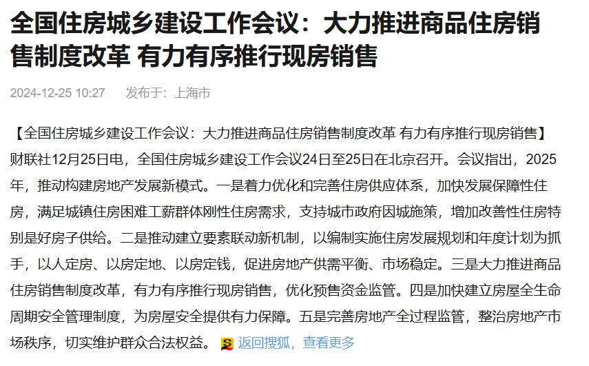
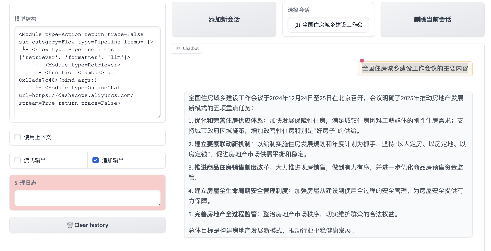

# 第二节 打造一个属于自己的文档解析器

说实话，第一次接触 RAG 系统的时候，我被文档格式这个问题折腾得够呛。

你想想看，一个系统要从成千上万的文档里找信息，这些文档什么格式都有——PDF、Word、PPT，甚至还有一些奇奇怪怪的格式。这就像是**你要从一个杂物间里找东西，但每个盒子的开法都不一样**。

这时候**文档解析器 Reader** 就派上用场了。它基本上就是个"万能钥匙"，专门负责打开这些不同格式的文档，然后把内容整理成系统能理解的样子。我之前用 LazyLLM 的时候发现，它其实已经内置了挺多格式的支持——从常见的 PDF、Word 甚至音视频文件都有。记得有一次项目里需要处理韩文的 hwp 文件，当时还挺惊喜的，居然默认就支持了。

但问题来了，总有**些时候默认的 Reader 满足不了需求**。比如说，**html 网页也是一种文档格式**，或者你想要 Reader 输出的内容**按照特定的方式**组织。这种情况下，自己写个 Reader 就很有必要了。

这篇教程就是教你怎么在 LazyLLM 里面自定义 Reader 的。说白了，就是告诉你怎么给系统加个新的"钥匙"，让它能处理那些原本处理不了的文档。学会这个之后，你基本上就能搭建一个能处理各种奇葩格式的 RAG 应用了——这在实际工作中还挺有用的，特别是当你面对一些不太兼容的文档格式时。

## Reader 是什么——阅读 document 组件内容的工具

---

回忆一下 RAG 的基本流程，用户一个问题进来，Retriever 要去找相关内容对吧？但问题是——它从哪儿找？

你的知识库里（**之前提到的 document 组件**）什么都有，PDF 文档、Excel 表格、甚至还有些老系统导出的 XML 文件。

Reader 这个模块就像是个**翻译官**，不管你的原始资料是什么格式——可能是整整齐齐存在数据库里的结构化数据，也可能是乱七八糟的 Word 文档——Reader 都得把它们"翻译"成检索模块能理解的统一格式。

那问题来了，**如何实现一个最小的 reader 组件呢**？

## 实现 Reader 组件

---

话说上回我们用[cmrc2018](https://huggingface.co/datasets/LazyAGI/CMRC2018_Knowledge_Base/tree/main) 数据集搭了个知识库（就是那个`data_kb`文件夹），今天咱们来看看怎么用 Reader 组件把里面的内容读出来。

废话不多说，直接上代码：

```python
# 导入 lazyllm.tools.rag 模块中的 Document 类
from lazyllm.tools.rag import Document

# 创建 Document 实例，指定数据集路径为当前目录下的 data_kb 文件夹
doc = Document(dataset_path="./data_kb")

# 使用 Document 实例的内部 reader 加载指定文件的数据
# 这里加载的是 data_kb 文件夹中的 part_1.txt 文件
data = doc._impl._reader.load_data(input_files=["./data_kb/part_1.txt"])

# 打印加载的数据内容，输出结果为data: [<Node id=2d75ea15-f278-4f78-98ba-41da7f442c81>]
print(f"data: {data}")
```

可能细心的你会问：

> 等等，这输出怎么是个 Node 对象？我的文本内容呢？

别急，得这么取：

```python
print(f"text: {data[0].text}")	#这里输出结果就是 part_1.txt 的文件内容了
```

说白了，Reader 就是把文档内容解析出来，然后包装成统一格式，方便后续模块使用。挺简单的对吧？

## 给 Reader 组件加上 html 解析功能

---

这时候问题来了 - **要是遇到 LazyLLM 不支持的文档格式咋办**？比如 HTML 文件？

我手头有个维基百科的 HTML 页面，用默认 Reader 一读，好家伙，直接把 HTML 源码都打印出来了：

```html
<!DOCTYPE html>
<html
  class="client-nojs vector-feature-language-in-header-enabled vector-feature-language-in-main-page-header-disabled vector-feature-page-tools-pinned-disabled vector-feature-toc-pinned-clientpref-1 vector-feature-main-menu-pinned-disabled vector-feature-limited-width-clientpref-1 vector-feature-limited-width-content-enabled vector-feature-custom-font-size-clientpref-1 vector-feature-appearance-pinned-clientpref-1 vector-feature-night-mode-enabled skin-theme-clientpref-day vector-sticky-header-enabled vector-toc-available"
  lang="zh-Hans-CN"
  dir="ltr"
>
  <head>
    <meta charset="UTF-8" />
    <title>网站 - 维基百科，自由的百科全书</title>
    ...
  </head>
</html>
```

这谁看得懂啊！我要的是纯文本内容，不是这堆标签，要是能打印出去掉标签的格式该多好。

我们可以**定义一个我们自己的 Reader**，因为读取 html 文件内容通常需要`BeautifulSoup`这个模块，所以我们先使用 `BeautifulSoup` 包**把 HTML 标签剥掉**，**把解析出来的文本包装成 LazyLLM 能识别的格式**，通过 DocNode 类实例化成一个 node 对象，然后再以 list 的格式返回。代码这样写：

```python
from lazyllm.tools.rag import Document, DocNode
from bs4 import BeautifulSoup
import re
from pathlib import Path


def clean_html_text(html_input, extra_info=None):
    """
    清理HTML文本，去除标签和多余的空白字符，并将其封装为DocNode对象
    :param html_input: 包含HTML标签的原始文本或文件路径
    :param extra_info: 额外的元数据信息
    :return: 包含DocNode对象的列表
    """
    # 如果输入是路径，则读取文件内容
    if isinstance(html_input, Path):
        with open(html_input, "r", encoding="utf-8") as f:
            html_content = f.read()
    else:
        html_content = html_input

    # 使用 BeautifulSoup 去除 HTML 标签，只保留纯文本内容
    soup = BeautifulSoup(html_content, "html.parser")
    clean_text = soup.get_text()

    # 去除多余的换行符和空白字符
    clean_text = re.sub(r"\n+", "\n", clean_text)  # 将多个连续的换行符替换为单个换行符
    clean_text = re.sub(r"\s+", " ", clean_text)  # 将多个连续的空白字符替换为单个空格

    # 创建 DocNode 对象并返回列表
    node = DocNode(text=clean_text, metadata=extra_info or {})
    return [node]
```

代码主要功能都在`clean_html_text`这个函数内，输入的内容是`html`文件，输出的内容是**保留纯文本内容，同时去掉多余的换行符和空白字符的 DocNode 列表**。

聪明的你可能会问了：

> 我先运行默认 Reader 解析，再去除标签和换行符不也一样吗？

这里有个巧妙的设计 - 注册机制。**直接看代码：**

```python
from lazyllm.tools.rag import Document, DocNode
from bs4 import BeautifulSoup
import re
from pathlib import Path


def clean_html_text(html_input, extra_info=None):
    """
    清理HTML文本，去除标签和多余的空白字符，并将其封装为DocNode对象
    :param html_input: 包含HTML标签的原始文本或文件路径
    :param extra_info: 额外的元数据信息
    :return: 包含DocNode对象的列表
    """
    # 如果输入是路径，则读取文件内容
    if isinstance(html_input, Path):
        with open(html_input, "r", encoding="utf-8") as f:
            html_content = f.read()
    else:
        html_content = html_input

    # 使用 BeautifulSoup 去除 HTML 标签，只保留纯文本内容
    soup = BeautifulSoup(html_content, "html.parser")
    clean_text = soup.get_text()

    # 去除多余的换行符和空白字符
    clean_text = re.sub(r"\n+", "\n", clean_text)  # 将多个连续的换行符替换为单个换行符
    clean_text = re.sub(r"\s+", " ", clean_text)  # 将多个连续的空白字符替换为单个空格

    # 创建 DocNode 对象并返回列表
    node = DocNode(text=clean_text, metadata=extra_info or {})
    return [node]


# 测试代码
if __name__ == "__main__":
   	# 创建 Document 实例，指定数据集路径
    doc = Document(dataset_path="./data_kb")
    # 为 Document 实例添加自定义 HTML reader
    doc.add_reader("*.html", clean_html_text)

    # 使用注册的 reader 加载指定的 HTML 文件
    data = doc._impl._reader.load_data(input_files=["./data_kb/网站.html"])
    # 打印加载的数据对象
    print(f"data: {data}")
    # 打印第一个数据节点的文本内容
    print(f"text: {data[0].text}")
```

`add_reader`这个方法太好用了，一行代码就把自定义解析器注册进去了。以后不管遇到多少 HTML 文件，都能自动用这个解析器处理，省了不少事。
说实话，LazyLLM 这个扩展机制设计得挺灵活的。你要是有 PDF、Word 或者其他格式的文档，照葫芦画瓢写个解析函数，注册一下就能用了。这比每次都单独写解析代码方便多了。

到这里，**我们成功打造了一个 html 的文档解析器**。

那我们能不能把这个自定义的解析器用到 RAG 系统里呢？

## 基于 html 解析器的 RAG 系统

---

这里我们在本地**新建一个数据集**，文件夹名叫`rag_data`，然后往这个文件夹里面放入你的 html 文件，**这个过程相当于构建你的知识库**。我的文件夹里面放了这些：

```bash
rag_data/
├── hongkong.html
├── housing.html
├── national_health_insurance_administration.html
└── 网站.html
```

准备好知识库之后，然后就是写代码了。关键是要把 HTML 转换成纯文本，这个处理过程上面已经实现过了：

```python
from lazyllm.tools.rag import Document, DocNode, Retriever
from bs4 import BeautifulSoup
import re
from pathlib import Path
import lazyllm
from lazyllm import bind


def clean_html_text(html_input, extra_info=None):
    """
    清理HTML文本，去除标签和多余的空白字符，并将其封装为DocNode对象
    :param html_input: 包含HTML标签的原始文本或文件路径
    :param extra_info: 额外的元数据信息
    :return: 包含DocNode对象的列表
    """
    # 如果输入是路径，则读取文件内容
    if isinstance(html_input, Path):
        with open(html_input, "r", encoding="utf-8") as f:
            html_content = f.read()
    else:
        html_content = html_input

    # 使用 BeautifulSoup 去除 HTML 标签，只保留纯文本内容
    soup = BeautifulSoup(html_content, "html.parser")
    clean_text = soup.get_text()

    # 去除多余的换行符和空白字符
    clean_text = re.sub(r"\n+", "\n", clean_text)  # 将多个连续的换行符替换为单个换行符
    clean_text = re.sub(r"\s+", " ", clean_text)  # 将多个连续的空白字符替换为单个空格

    # 创建 DocNode 对象并返回列表
    node = DocNode(text=clean_text, metadata=extra_info or {})
    return [node]


# 创建 Document 实例，指定数据集路径
rag_data_path = "./rag_data"
documents = Document(dataset_path=rag_data_path)
# 为 Document 实例添加自定义 HTML reader
documents.add_reader("*.html", clean_html_text)

# 定义提示词模板，告诉模型扮演AI问答助手的角色
prompt = "You will act as an AI question-answering assistant and complete a dialogue task. \
          In this task, you need to provide your answers based on the given context and questions."

# 创建一个处理流程(pipeline)，包含检索和生成两个主要步骤
with lazyllm.pipeline() as ppl:
    # 检索组件定义：用于从知识库中检索相关信息
    # doc: 指定文档对象
    # group_name: 指定文档分组方式为"CoarseChunk"(粗粒度分块)
    # similarity: 使用"bm25_chinese"算法计算相似度，适合中文检索
    # topk: 返回最相关的3个结果
    ppl.retriever = Retriever(
        doc=documents, group_name="CoarseChunk", similarity="bm25_chinese", topk=3
    )

    # 格式化组件：将检索到的节点内容和查询问题格式化为适合LLM处理的格式
    # nodes: 检索到的文档节点
    # query: 用户的查询问题
    # context_str: 将所有检索到的节点内容拼接成字符串
    ppl.formatter = (
        lambda nodes, query: {
            "query": query,
            "context_str": "".join([node.get_content() for node in nodes]),
        }
    ) | bind(query=ppl.input)

    # 生成组件定义：使用在线大语言模型进行回答生成
    # source: 指定模型来源为"qwen"(通义千问)
    # model: 指定具体模型为"qwen-plus-latest"
    # api_key: 设置API密钥用于访问模型
    # prompt: 使用ChatPrompter包装提示词模板，并添加额外的context_str上下文信息
    ppl.llm = lazyllm.OnlineChatModule(
        source="qwen",
        model="qwen-plus-latest",
        api_key="sk-这里填写你申请的key",
    ).prompt(lazyllm.ChatPrompter(instruction=prompt, extra_keys=["context_str"]))

# 启动Web服务模块，提供图形化界面进行交互
# ppl: 传入上面定义的处理流程
# port: 指定服务运行端口为23466
lazyllm.WebModule(ppl, port=23466).start().wait()
```

大致执行流程可以参考**注释**：首先定义了一个 `clean_html_text` 函数，用于清理 HTML 文本，去除标签和多余的空白字符，并将其封装为 `DocNode` 对象。然后，它创建了一个 `Document` 实例，指定 `rag_data` 目录作为数据源，并为该实例添加了自定义的 HTML 读取器。接下来，脚本定义了一个处理流程（pipeline），包含检索和生成两个主要步骤。检索组件使用 `bm25_chinese` 算法从知识库中检索最相关的 3 个结果。生成组件则使用通义千问（Qwen）大语言模型，根据检索到的上下文和用户问题生成回答。最后，脚本启动了一个 Web 服务模块，提供图形化界面进行交互，用户可以通过 [http://127.0.0.1:23466](http://127.0.0.1:23466) 与系统进行交互。

系统跑起来之后，我测试了一下。比如我问"全国住房城乡建设工作会议的主要内容"，系统准确地从`national_health_insurance_administration.html`里找到了相关内容。看截图就知道，不仅找对了文件，还把关键信息都提取出来了。





其实整个过程最让我惊喜的是，处理后的效果比我预期的好很多。原本那些杂乱的 HTML 页面，经过清理后变成了结构化的知识库，查询起来特别顺畅。

不过也有些不足的地方。比如有些**HTML 里面的表格数据**，用`get_text()`提取后格式会乱掉。可能需要针对表格单独处理。还有就是图片信息会丢失，如果 HTML 里有重要的图表，目前这个方案是处理不了的。

总的来说，这个方案对于处理大量 HTML 文档还是挺实用的。特别是你有很多网页形式的资料需要整理成知识库时，这个方法能省不少事。关键是`BeautifulSoup`和`LazyLLM`配合得很好，几十行代码就能搭建一个可用的系统。
