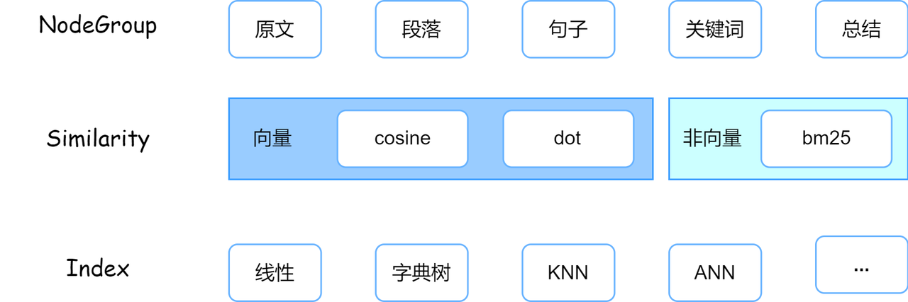
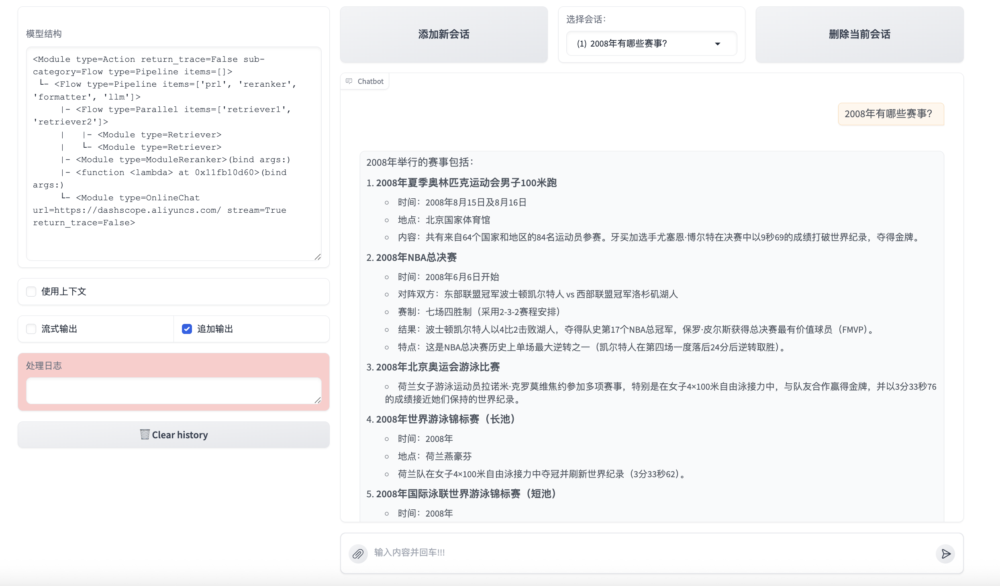

# 第四节 实战召回优化

上一节我们讲了召回的重要性，这一节内容我们将在代码层面实现优化召回率的几种方式。

衡量**检索**（Retriever）组件的两个标准是**召回率**（Context Recall）**和上下文相关性**（Context Relevance）。那么这两个指标到底应该怎么计算呢？

## 召回率和上下文相关性的计算

**上下文召回率**，说白了就是看你**该找到的东西有没有都找到**。打个比方，如果正确答案**需要 5 个关键信息点**，你的**检索系统找回来了 3 个**，那召回率就是 60%。数学公式虽然看着唬人，其实道理很简单——就是算个交集除以总数嘛。当然了，召回率越高，说明**检索组件召回的信息越全面**。

**上下文相关性**，这个是看你**找回来的东西里，有多少是真正有用的**。我之前碰到过一个特别搞笑的例子，问"**苹果手机的电池容量**"，结果系统把关于"**苹果营养价值**"的内容也召回来了。虽然都有"苹果"这个词，但完全是两码事儿。这种情况下，相关性就很低了。同样的，上下文相关性越高，说明**检索组件检索到的上下文与查询的语义相关性越强**。

实际操作的时候，LazyLLM 这个工具还挺好用的。你把问题、标准答案、检索到的内容，还有应该检索到的内容都准备好，几行代码就能算出这些指标。不过有个坑要注意——如果用 LLM 来评估的话，token 消耗会比较大，钱包要做好准备。

我们通过一个简单案例模拟一下这两个指标的计算，直接上代码：

```python
import lazyllm
from lazyllm.tools.eval import LLMContextRecall, NonLLMContextRecall, ContextRelevance

# 检索组件要求准备满足如下格式要求的数据进行评估
data = [
    {
        "question": "非洲的猴面包树果实的长度约是多少厘米？",
        # 当使用基于LLM的评估方法时要求答案是标注的正确答案
        "answer": "非洲猴面包树的果实长约15至20厘米。",
        # context_retrieved 为召回器召回的文档，按段落输入为列表
        "context_retrieved": [
            "非洲猴面包树是一种锦葵科猴面包树属的大型落叶乔木，原产于热带非洲，它的果实长约15至20厘米。",
            "钙含量比菠菜高50％以上，含较高的抗氧化成分。",
        ],
        # context_reference 为标注的应当被召回的段落
        "context_reference": [
            "非洲猴面包树是一种锦葵科猴面包树属的大型落叶乔木，原产于热带非洲，它的果实长约15至20厘米。"
        ],
    }
]
# 返回召回文档的命中率，例如上述data成功召回了标注的段落，因此召回率为1
m_recall = NonLLMContextRecall()
res = m_recall(data)  # 1.0
print(res)

# 返回召回文档中的上下文相关性分数，例如上述data召回的两个句子中只有一个是相关的
m_cr = ContextRelevance()
res = m_cr(data)  # 0.5
print(res)

# 返回基于LLM计算的召回率，LLM基于answer和context_retrieved判断是否召回了所有相关文档
# 适用于没有标注的情况下使用，比较耗费 token ，请根据需求谨慎使用
m_lcr = LLMContextRecall(
    lazyllm.OnlineChatModule(
        source="qwen",
        model="qwen-plus-latest",
        api_key="sk-这里填写你申请的key",
    )
)
res = m_lcr(data)  # 1.0
print(res)
```

我们自己定义了一个非常简单的数据集。`context_retrieved`表示**实际被召回**的段落，`context_reference` 表示标注的**应当被召回**的段落。

LazyLLM 在评估召回率上有两种方式，一种是`NonLLMContextRecall`方法，这种情况不调用大语言模型计算，由于`context_retrieved` 包含了 `context_reference` 中的所有内容，因此所有相关的上下文都被成功召回了，召回率为 1。

另一种方式是`LLMContextRecall`方法，这种情况会调用大语言模型，基于`answer`和`context_retrieved`判断是否召回了所有相关文档。大致流程是这样的：

1. 输入数据 ：需要包含 `question` （问题）、 `answer` （标准答案）和 `context_retrieved` （检索器召回的文档）字段。

2. 处理过程 ：

   1. 将所有召回的文档内容连接成一个字符串作为上下文。
   2. 构造一个查询字符串，包含问题、上下文和标准答案。
   3. 使用大语言模型（LLM）对这个查询进行评估，判断答案中的每个句子是否可以归因于给定的上下文。

3. 评估逻辑 ：

   1. LLM 会分析答案中的每个句子，并给出二元评分（1 表示完全支持，0 表示不支持/矛盾）。评估结果是一个包含每个句子评分的列表。

4. 计算召回率 ：计算所有句子评分的平均值，即为最终的召回率。

同样由于 `context_retrieved` 包含了 `context_reference` 的所有内容，因此 LLM 判断所有句子都得到了支持，召回率为 1.0。

计算召回率 ：

上下文相关性分数`ContextRelevance`就更好理解了，`context_retrieved`里面与问答相关的只有一句话，所以分数为 0.5。

当然了，这个数据集是我们自定义的。如果使用真实的数据集呢？我们用第二节实现的基于 [cmrc2018](https://huggingface.co/datasets/LazyAGI/CMRC2018_Knowledge_Base/tree/main) 数据集做的 RAG 系统进行评测，以下是评测代码：

```python
# 导入所需的库
import lazyllm
# 导入评估工具：LLMContextRecall（基于大语言模型的上下文召回率）、NonLLMContextRecall（非大语言模型的上下文召回率）、ContextRelevance（上下文相关性）
from lazyllm.tools.eval import LLMContextRecall, NonLLMContextRecall, ContextRelevance
# 导入Hugging Face datasets库，用于加载数据集
from datasets import load_dataset

# 加载cmrc2018数据集，指定缓存目录为当前目录下的datasets文件夹
dataset = load_dataset("cmrc2018", cache_dir="./datasets")


def create_evaluation_data(test_dataset, topk_values=[1, 3, 5]):
    """创建用于评估的数据结构

    Args:
        test_dataset: 测试数据集
        topk_values: 检索器返回的topk值（召回的文档数）列表，默认为[1, 3, 5]

    Returns:
        dict: 包含不同topk值评估数据的字典
    """
    # 文档加载，将data_kb目录作为知识库
    documents = lazyllm.Document(dataset_path="./data_kb")

    # 初始化评估数据字典
    evaluation_data = {}

    # 为每个topk值创建评估数据
    for topk in topk_values:
        # 检索组件定义
        # doc: 指定文档对象
        # group_name: 指定文档分组方式为"CoarseChunk"(粗粒度分块)
        # similarity: 使用"bm25_chinese"算法计算相似度，适合中文检索
        # topk: 返回最相关的topk个结果
        retriever = lazyllm.Retriever(
            doc=documents, group_name="CoarseChunk", similarity="bm25_chinese", topk=topk
        )

        # 初始化数据列表
        data = []
        # 使用测试集的前10个样本进行评估
        for i in range(min(10, len(test_dataset))):
            # 获取当前样本
            sample = test_dataset[i]
            # 提取问题
            question = sample["question"]
            # 提取答案，取第一个答案作为标准答案
            answer = sample["answers"]["text"][0]
            # 提取标注的应当被召回的段落
            context_reference = [sample["context"]]

            # 获取检索器召回的文档
            doc_node_list = retriever(query=question)
            # 提取召回文档的内容
            context_retrieved = [node.get_content() for node in doc_node_list]

            # 将数据添加到列表中
            data.append({
                "question": question,
                "answer": answer,
                "context_retrieved": context_retrieved,
                "context_reference": context_reference,
            })

        # 将当前topk值的数据添加到评估数据字典中
        evaluation_data[topk] = data

    return evaluation_data


def evaluate_rag_performance(evaluation_data):
    """评估RAG性能

    Args:
        evaluation_data: 包含不同topk值评估数据的字典

    Returns:
        dict: 包含不同topk值评估结果的字典
    """
    # 初始化评估工具
    # NonLLMContextRecall: 计算召回文档的命中率
    m_recall = NonLLMContextRecall()
    # ContextRelevance: 计算召回文档中的上下文相关性分数
    m_cr = ContextRelevance()
    # LLMContextRecall: 计算基于LLM的召回率
    m_lcr = LLMContextRecall(
        lazyllm.OnlineChatModule(
            source="qwen",
            model="qwen-plus-latest",
            api_key="sk-这里填写你申请的key",
        )
    )

    # 初始化结果字典
    results = {}

    # 对每个topk值进行评估
    for topk, data in evaluation_data.items():
        print(f"\n=== TopK = {topk} 评估结果 ===")

        # 计算召回文档的命中率
        recall_score = m_recall(data)
        print(f"召回率 (Recall): {recall_score}")

        # 计算召回文档中的上下文相关性分数
        relevance_score = m_cr(data)
        print(f"上下文相关性 (Context Relevance): {relevance_score}")

        # 计算基于LLM的召回率
        try:
            llm_recall_score = m_lcr(data)
            print(f"基于LLM的召回率 (LLM Context Recall): {llm_recall_score}")
        except Exception as e:
            print(f"计算基于LLM的召回率时出错: {e}")
            llm_recall_score = 0.0

        # 将结果添加到结果字典中
        results[topk] = {
            "recall": recall_score,
            "relevance": relevance_score,
            "llm_recall": llm_recall_score
        }

    return results


def main():
    # 创建评估数据
    print("正在创建评估数据...")
    evaluation_data = create_evaluation_data(dataset["test"], topk_values=[1, 3, 5])

    # 评估RAG性能
    print("开始评估RAG性能...")
    results = evaluate_rag_performance(evaluation_data)

    # 打印最终结果
    print("\n=== 最终评估结果 ===")
    for topk, scores in results.items():
        print(f"\nTopK = {topk}:")
        print(f"  召回率: {scores['recall']:.4f}")
        print(f"  上下文相关性: {scores['relevance']:.4f}")
        print(f"  基于LLM的召回率: {scores['llm_recall']:.4f}")


if __name__ == "__main__":
    main()
```

我看了下 [cmrc2018](https://huggingface.co/datasets/LazyAGI/CMRC2018_Knowledge_Base/tree/main) 数据集的测试结果，还是很满意的。

| TopK 值 | 召回率 | 上下文相关性 | 基于 LLM 的召回率 |
| ------- | ------ | ------------ | ----------------- |
| 1       | 0.9000 | 1.0000       | 1.0000            |
| 3       | 1.0000 | 0.3567       | 0.9000            |
| 5       | 1.0000 | 0.2161       | 0.9000            |

不知道有没有发现这样一个现象，随着召回文档数量增加，相关性反而从 100%掉到 21.6%了。这就像是**为了找一个答案，把整个图书馆的书都搬过来，结果真正有用的反而被淹没了**。

这种情况我太熟悉了。刚开始做 RAG 的时候，总想着多召回一些文档总没错吧？结果发现不是这么回事儿。**垃圾信息太多，大模型也会被带偏**。有一次我们的系统，用户问"如何做西红柿炒蛋"，结果因为召回了太多无关内容，最后回答里居然出现了"西红柿的种植技术"...

所以现在做 RAG，不能光追求召回率，相关性同样重要。这就像做菜，不是食材越多越好，而是要精准。宁可少而精，也不要多而杂。当然，怎么在两者之间找平衡，这又是另一个让人头疼的问题了。

## 提升指标的优化策略

做了这么久 RAG，我最大的感受就是——**没有完美的方案，都是在各种 trade-off 中找平衡**。不同的业务场景需要不同的优化重点，有时候甚至需要牺牲一些召回率来换取精确度。关键是要根据实际情况灵活调整，别死磕某一个指标。

先说**查询重写**这块儿吧。我之前碰到过一个特别典型的案例——用户问"这个怎么处理"，你说这让系统怎么理解？后来我们就在查询重写上下了功夫。比如**在医疗领域的项目**里，用户说"**头疼**"，我们会自动扩展成"**头痛、偏头痛、头部疼痛**"这些同义词，召回率一下子就上去了。不过说真的，这招在**专业领域特别好使，通用场景下反而容易引入噪音**。

**节点组**这个事儿，我是真的踩过坑。之前有个项目，**文档切得特别碎，一段话能切成三四块，结果召回的时候经常是前言不搭后语**。后来重新调整了分块策略——**把相关的内容尽量放在一个 chunk 里**，效果立竿见影。我现在的经验是，与其追求固定长度的分块，不如按主题来切，哪怕有的块大点有的块小点。

**检索方式的选择**其实挺有意思的。我们团队试过各种组合，最后发现没有银弹。向量检索对语义理解好，BM25 对关键词匹配准，两个结合起来用效果最好。有个小技巧——设置相似度阈值的时候别太激进，我一般设在 0.7 左右，太高了容易漏召回，太低了又全是垃圾。

**重排序**这个真的是个好东西！我们现在基本上都是先粗召回个几十篇，然后用个轻量级的重排模型筛选。这里有个坑要注意——重排模型最好用领域内的数据微调一下，通用模型在特定领域表现经常拉胯。

最后说说**多路召回**，这个策略我们现在用得特别多。打个比方，就像是撒网捕鱼，多撒几个网总比一个网捞得多。我们通常会配置 3-4 路不同的召回器，有的负责精确匹配，有的负责语义相似，最后再统一排序。虽然计算开销大了点，但效果是真的好。

那么如何从**代码层面实现这些优化策略**呢？

## 基于大模型的查询重写策略

这种策略可以细分成**查询扩写**、**子问题查询**和**多步骤查询**三类。我们一点一点实现。

### 查询扩写

用户查询常常信息不足或存在歧义，影响检索效果。查询扩写通过同义词补充、上下文补全、模板转换等方式，使查询更清晰具体，从而提升准确率和召回率。我们还是基于 [cmrc2018](https://huggingface.co/datasets/LazyAGI/CMRC2018_Knowledge_Base/tree/main) 数据集做的 RAG 系统继续优化，上代码：

```python
# 查询扩写
# 导入必要的库
import lazyllm
from lazyllm import Document, ChatPrompter, Retriever

# 查询改写提示词
# 用于将用户的查询改写得更加清晰，不回答问题
rewrite_prompt = "你是一个查询改写助手，将用户的查询改写的更加清晰。\
                注意，你不需要对问题进行回答，只需要对原始问题进行改写。\
                下面是一个简单的例子：\
                输入：RAG\
                输出：为我介绍下RAG。\
                    \
                用户输入为："

# AI问答助手提示词
# 用于根据上下文和问题提供答案
robot_prompt = "你是一个友好的 AI 问答助手，你需要根据给定的上下文和问题提供答案。\
                根据以下资料回答问题：\
                {context_str} \n"

# 加载文档库，定义检索器和在线大模型
# 创建文档对象，指定数据集路径
documents = Document(dataset_path="./data_kb")  # 请在 dataset_path 传入数据集绝对路径
# 创建检索器，指定文档、分组名、相似度算法和返回结果数量
retriever = Retriever(
    doc=documents, group_name="CoarseChunk", similarity="bm25_chinese", topk=3
)  # 定义检索组件
# 创建在线大模型对象，指定来源、模型和API密钥
llm = lazyllm.OnlineChatModule(
    source="qwen",
    model="qwen-plus-latest",
    api_key="sk-这里填写你申请的key",
)  # 调用大模型

# 设置大模型的提示词
llm.prompt(ChatPrompter(instruction=robot_prompt, extra_keys=["context_str"]))
# 定义查询问题
query = "MIT OpenCourseWare是啥？"

# 创建查询改写器并改写查询
query_rewriter = llm.share(ChatPrompter(instruction=rewrite_prompt))
query = query_rewriter(query)
print(f"改写后的查询：\n{query}")

# 使用检索器检索相关文档
doc_node_list = retriever(query=query)

# 将查询和召回节点中的内容组成dict，作为大模型的输入
# 构造大模型输入参数，包括查询和上下文
res = llm(
    {
        "query": query,
        "context_str": "".join([node.get_content() for node in doc_node_list]),
    }
)

# 输出大模型的回答
print("\n回答: ", res)
```

### 子问题查询

将主问题拆解为多个子问题，有助于系统从不同角度理解问题并生成更全面的答案。**每个子问题单独检索，最后合并答案**。适用于**抽象或复合型查询**，但需注意处理性能开销。我们配合前面的查询扩写进行优化，上代码：

```python
# 子问题查询
# 导入必要的库
import lazyllm
from lazyllm import Document, ChatPrompter, Retriever

# 查询改写提示词
# 用于将用户的查询改写得更加清晰，不回答问题
rewrite_prompt = "你是一个查询改写助手，将用户的查询改写的更加清晰。\
                注意，你不需要对问题进行回答，只需要对原始问题进行改写。\
                下面是一个简单的例子：\
                输入：RAG\
                输出：为我介绍下RAG。\
                    \
                用户输入为："

# 子问题拆分提示词
# 用于将主问题拆解为多个子问题，有助于系统从不同角度理解问题
sub_query_prompt = "你是一个查询重写助手，如果用户查询较为抽象或笼统，将其分解为多个角度的具体问题。\
                  注意，你不需要进行回答，只需要根据问题的字面进行子问题拆分，输出不要超过3条。\
                  下面是一个简单的例子：\
                  输入：RAG是什么？\
                  输出：RAG的定义是什么？\
                       RAG是什么领域内的名词？\
                       RAG有什么特点？"

# AI问答助手提示词
# 用于根据上下文和问题提供答案
robot_prompt = "你是一个友好的 AI 问答助手，你需要根据给定的上下文和问题提供答案。\
                根据以下资料回答问题：\
                {context_str} \n"

# 加载文档库，定义检索器和在线大模型
# 创建文档对象，指定数据集路径
documents = Document(dataset_path="./data_kb")  # 请在 dataset_path 传入数据集绝对路径
# 创建检索器，指定文档、分组名、相似度算法和返回结果数量
retriever = Retriever(
    doc=documents, group_name="CoarseChunk", similarity="bm25_chinese", topk=3
)  # 定义检索组件
# 创建在线大模型对象，指定来源、模型和API密钥
llm = lazyllm.OnlineChatModule(
    source="qwen",
    model="qwen-plus-latest",
    api_key="sk-这里填写你申请的key",
)  # 调用大模型

# 设置大模型的提示词
llm.prompt(ChatPrompter(instruction=robot_prompt, extra_keys=["context_str"]))
# 定义查询问题
query = "MIT OpenCourseWare是啥？"

# 创建查询改写器并改写查询
query_rewriter = llm.share(ChatPrompter(instruction=rewrite_prompt))
query = query_rewriter(query)
print(f"改写后的查询：\n{query}")

# 创建子问题生成器
sub_query_generator = llm.share(ChatPrompter(instruction=sub_query_prompt))
sub_queries_str = sub_query_generator(query)
sub_queries = [q.strip() for q in sub_queries_str.split('\n') if q.strip()]
print(f"拆分的子问题：\n{sub_queries}")

# 对每个子问题进行检索并合并结果
all_context = []
for sub_query in sub_queries:
    print(f"\n正在处理子问题: {sub_query}")
    # 使用检索器检索与子问题相关的文档
    doc_node_list = retriever(query=sub_query)
    # 将检索到的文档内容添加到上下文列表中
    for node in doc_node_list:
        all_context.append(node.get_content())

# 去重并合并上下文
# 使用set去除重复内容，然后合并为一个字符串
unique_context = list(set(all_context))
context_str = "".join(unique_context)
print(f"\n合并后的上下文长度: {len(context_str)}")

# 将查询和合并后的上下文作为大模型的输入
# 构造输入字典，包含查询和上下文
res = llm(
    {
        "query": query,
        "context_str": context_str,
    }
)

# 输出大模型的回答
print("\n回答: ", res)
```

这次的输出会多一段处理的子问题以及合并之后的上下文长度：

```bash
正在处理子问题: MIT OpenCourseWare 由哪个机构推出？

正在处理子问题: MIT OpenCourseWare 提供哪些类型的课程资源？

合并后的上下文长度: 3475
```

### 多步骤查询

将**复杂问题拆解为连续的多个步骤**，每一步依赖上一步的答案推进。**适合需要多轮推理的场景**，能有效提升对复杂问题的处理能力。我们配合前面的查询扩写进行优化，上代码：

```python
# 分步骤查询
# 导入必要的库
import lazyllm
from lazyllm import Document, ChatPrompter, Retriever

# prompt设计
# 查询改写提示词，用于将用户的查询改写得更加清晰，不回答问题
rewrite_prompt = "你是一个查询改写助手，将用户的查询改写的更加清晰。\
                注意，你不需要对问题进行回答，只需要对原始问题进行改写。\
                下面是一个简单的例子：\
                输入：RAG\
                输出：为我介绍下RAG。\
                    \
                用户输入为："

# 判别提示词，用于判断某个回答能否解决对应的问题
judge_prompt = "你是一个判别助手，用于判断某个回答能否解决对应的问题。如果回答可以解决问题，则输出True，否则输出False。\
                注意，你的输出只能是True或者False。不要带有任何其他输出。\
                当前回答为{context_str} \n"

# AI问答助手提示词，用于根据上下文和问题提供答案
robot_prompt = "你是一个友好的 AI 问答助手，你需要根据给定的上下文和问题提供答案。\
                根据以下资料回答问题：\
                {context_str} \n"

# 加载文档库，定义检索器和在线大模型
# 创建文档对象，指定数据集路径
documents = Document(dataset_path="./data_kb")  # 请在 dataset_path 传入数据集绝对路径
# 创建检索器，指定文档、分组名、相似度算法和返回结果数量
retriever = Retriever(
    doc=documents, group_name="CoarseChunk", similarity="bm25_chinese", topk=3
)  # 定义检索组件
# 创建在线大模型对象，指定来源、模型和API密钥
llm = lazyllm.OnlineChatModule(
    source="qwen",
    model="qwen-plus-latest",
    api_key="sk-这里填写你申请的key",
)  # 调用大模型

# 创建查询改写器
rewrite_robot = llm.share(ChatPrompter(instruction=rewrite_prompt))

# 创建AI问答助手
robot = llm.share(ChatPrompter(instruction=robot_prompt, extra_keys=["context_str"]))

# 创建判别助手
judge_robot = llm.share(ChatPrompter(instruction=judge_prompt, extra_keys=["context_str"]))

# 定义查询问题
query = "MIT OpenCourseWare是啥？"

# 分步骤查询逻辑
LLM_JUDGE = False
while LLM_JUDGE is not True:
    # 执行查询重写
    query_rewrite = rewrite_robot(query)
    print(f"\n重写的查询：{query_rewrite}")

    # 获取重写后的查询结果
    doc_node_list = retriever(query_rewrite)
    # 使用AI问答助手生成回答
    res = robot({"query": query_rewrite, "context_str": "\n".join([node.get_content() for node in doc_node_list])})

    # 判断当前回复是否能满足query要求
    LLM_JUDGE = bool(judge_robot({"query": query, "context_str": res}))
    print(f"\nLLM判断结果：{LLM_JUDGE}")

# 打印最终结果
print("\n最终回复: ", res)
```

这次的输出会多一段每一步骤的回复能否满足查询的要求，由`LLM_JUDGE`这个变量决定：

```bash
LLM判断结果：True
```

## 节点组优化

你还记得 Retriever 是怎么定义的吗？

```python
retriever = Retriever(
    doc=documents, group_name="CoarseChunk", similarity="bm25_chinese", topk=3
)  # 定义检索组件
```

LazyLLM 的 Retriever 设计挺巧妙的，它把检索拆成了三个关键部分。Node Group（对应的就是`group_name`）**负责文档怎么切**，Similarity**管相关性怎么算**，Index 管**检索快不快**。这三个东西就像是做菜的食材、调料和火候，缺一不可。



说到 Node Group，这玩意儿其实就是**决定你检索的最小单位是什么**。我之前有个项目，客户的文档特别长，一篇技术手册能有上百页。如果**不切分，检索出来就是整篇文档**，根本没法用。但**切太碎了也不行**——我试过按句子切，结果经常出现"因此..."、"如上所述..."这种没头没尾的句子。

LazyLLM 的做法挺聪明，它先把文档读进来形成 Origin Node Group，就是**原始的大块文本**。然后你可以**根据需要创建不同粒度的节点组**。系统会先完整读进来，然后你可以按句号切分，每个句子变成一个独立的节点，但它会记住父节点是谁。这样**即使检索到某个句子，也能追溯回原文**。

最让我觉得实用的是它的**懒加载机制**。你定义了转换规则后，节点不会立即生成，而是等到真正需要的时候才创建。这在处理大规模文档库的时候特别有用。

**相似度计算**这块，BM25 和向量检索各有千秋。**BM25 就像是个老实人，关键词匹配特别准**，用户搜"错误代码 404"，它肯定能找到包含这些词的文档。但**向量检索更懂语义**，用户问"网页打不开"，它能理解这可能跟 404 错误相关。我现在的做法是两个都用，然后根据场景调权重。

LazyLLM 还提供了**几个预设的分块方案**。**CoarseChunk 是 1024 字符一块，重合长度为 100，适合需要较完整上下文的场景**；**MediumChunk 是 256 字符一块，重合长度为 25；FineChunk 只有 128 字符，重合长度为 12**，适合精确匹配。我一般会创建多个不同粒度的节点组，检索的时候多路召回，这样既能保证召回率，又不会丢失上下文。

还有个 LLMParser 的功能我觉得挺有意思，它可以**用大模型对文本进行转换，比如提取摘要或者生成问答对**。我在一个 FAQ 系统里用过这个，先让模型把文档转成问答对形式，检索效果提升特别明显。不过这个比较耗资源，大规模使用要考虑成本。

有个细节特别重要——节点之间的关联关系。LazyLLM 会记录父子节点关系，这样你检索到一个细粒度的节点后，可以往上找到它的完整段落，也可以往下找到所有相关的子节点。这个功能在做多跳问答的时候特别有用。

### 多个节点组协同

那么问题来了，我们能不能**实现多个节点组**呢？请看代码：

```python
from lazyllm import Document, Retriever, SentenceSplitter

docs = Document("./data_kb")

# 使用内置 SentenceSplitter 创建新的 node group
# 此处 chunk_size 和 chunk_overlap 会透传给 SentenceSplitter
# 最终输出的分块规则为 长度为 512，重叠为 64
docs.create_node_group(name='512Chunk', transform=SentenceSplitter, chunk_size=512, chunk_overlap=64)

# 查看节点组内容，此处我们通过一个检索器召回一个节点并打印其中的内容，后续都通过这个方式实现
group_names = ["CoarseChunk", "MediumChunk", "FineChunk", "512Chunk"]
for group_name in group_names:
    retriever = Retriever(docs, group_name=group_name, similarity="bm25_chinese", topk=1)
    node = retriever("亚硫酸盐有什么作用？")
    print(f"======= {group_name} =====")
    print(node[0].get_content())
```

上面的`group_names`实际上使用了三个系统的节点组，`CoarseChunk`、`MediumChunk`和`FineChunk`，还有一个自定义的节点组`512Chunk`。节点组支持以下参数：

- ​`name` （str, default: None）: 新的节点组的名称
- ​`transform`（Callable）： 节点组**解析规则**，函数原型是 `(DocNode, group_name, **kwargs) -> List[DocNode]`。LazyLLM 内置了 `SentenceSplitter`，用户也传入可调用对象实现**自定义转换规则**。
- ​`parent`（str, default: LAZY_ROOT_NAME）：**基于哪个节点组进行解析**，默认情况下基于全文节点组（即上文提到的 origin）进行构造，用户可以指定该参数实现更高效的节点组构造
- ​`trans_node`（bool, default: None ) 决定了 transform 的输入和输出是 DocNode 还是 str ，默认为 None。只有在 transform 为 Callable 时才可以设置为 true。
- ​`num_workers`（int，default：0）：Transform 时所用的新线程数量，默认为 0
- ​`kwargs`：和具体实现相关的参数，会透传至 transform 函数。

### 自定义节点组分块策略

聪明的你可能明白了，**实际上节点组真正发挥功能的核心是**​**​`transform`​**​**函数**。既然这样，是不是可以自定义`transform`​**函数呢**？

当然是可以的，下面的代码实现了**基于句号进行分块的节点组**：

```python
from lazyllm import Document, Retriever
from lazyllm.tools.rag.doc_node import DocNode

docs = Document("./data_kb")


# 第一种：函数实现直接对字符串进行分块规则
def split_by_sentence1(node: str, **kwargs):
    """函数接收字符串，返回字符串列表，输入为trans_node=False时调用"""
    return node.split("。")


docs.create_node_group(name="block1", transform=split_by_sentence1)


# 第二种：函数实现获取DocNode对应文本内容后进行分块，并构造DocNode
# 适用于返回非朴素DocNode，例如LazyLLM提供了ImageDocNode等特殊DocNode
def split_by_sentence2(node: DocNode, **kwargs):
    """函数接收DocNode，返回DocNode列表，输入为trans_node=False时调用"""
    content = node.get_text()
    nodes = []
    for text in content.split("。"):
        nodes.append(DocNode(text=text))
    return nodes


docs.create_node_group(name="block2", transform=split_by_sentence2, trans_node=True)


# 第三种：实现了 __call__ 函数的类
# 优点是一个类用于多种分块，例如这个例子可以通过控制实例化时的参数实现基于多种符号的分块
class SymbolSplitter:
    """实例化后传入Transform，默认情况下接收字符串，trans_node为true时接收DocNode"""

    def __init__(self, splitter="。", trans_node=False):
        self._splitter = splitter
        self._trans_node = trans_node

    def __call__(self, node):
        if self._trans_node:
            return node.get_text().split(self._splitter)
        return node.split(self._splitter)


sentence_splitter_1 = SymbolSplitter()
docs.create_node_group(name="block3", transform=sentence_splitter_1)

# 指定传入 DocNode
sentence_splitter_2 = SymbolSplitter(trans_node=True)
docs.create_node_group(name="block4", transform=sentence_splitter_2, trans_node=True)

# 指定分割符号为 \n
paragraph_splitter = SymbolSplitter(splitter="\n")
docs.create_node_group(name="block5", transform=paragraph_splitter)

# 第四种：直接传入lambda函数，适用于简单规则情况
docs.create_node_group(name="block6", transform=lambda b: b.split("。"))

# 查看节点组内容，此处我们通过一个检索器召回一个节点并打印其中的内容，后续都通过这个方式实现
for i in range(6):
    group_name = f"block{i + 1}"
    retriever = Retriever(
        docs, group_name=group_name, similarity="bm25_chinese", topk=1
    )
    node = retriever("亚硫酸盐有什么作用？")
    print(f"======= {group_name} =====")
    print(node[0].get_content())
```

### 小块召回大块

可能你会问了，能不能**实现通过小块召回大块**，也就是召回到某个节点时，取出该节点的内容，同时取出该节点的父节点？当然可以，下面是示例代码：

```python
import lazyllm
from lazyllm import Document, Retriever, OnlineChatModule

# 创建在线大模型对象，指定来源、模型和API密钥
llm = OnlineChatModule(
    source="qwen",
    model="qwen-plus-latest",
    api_key="sk-这里填写你申请的key",
)  # 调用大模型

prompt = "你是一个友好的 AI 问答助手，你需要根据给定的上下文和问题提供答案。\
          根据以下资料回答问题：\
          {context_str} \n "

robot = llm.prompt(lazyllm.ChatPrompter(instruction=prompt, extra_keys=["context_str"]))

# 文档加载
docs = Document("./data_kb")
docs.create_node_group(
    name="sentences",
    transform=(lambda d: d.split("\n") if d else ""),
    parent=Document.CoarseChunk,
)

# 定义两个不同的检索器在同一个节点组使用不同相似度方法进行检索
retriever = Retriever(docs, group_name="sentences", similarity="bm25_chinese", topk=3)

# 执行查询
query = "都有谁参加了2008年的奥运会？"

# 原节点检索结果
doc_node_list = retriever(query=query)
doc_node_res = "".join([node.get_content() for node in doc_node_list])
print(f"原节点检索结果：\n{doc_node_res}")
print("=" * 100)

# 父节点对应结果
parent_list = [node.parent.get_text() for node in doc_node_list]
print(f"父节点检索结果：\n{''.join(parent_list)}")
print("=" * 100)

# 将query和召回节点中的内容组成dict，作为大模型的输入
res = robot(
    {"query": query, "context_str": "".join([node_text for node_text in parent_list])}
)

print("系统答案：\n", res)
```

### 基于 LLM 的节点组

除了上述固定长度分块方法，LazyLLM 提供了 LLMParser 可以实现基于 LLM 对文档进行解析的操作，支持三种模式：

- **摘要提取**（summary）：对文段内容进行分析，提炼出核心信息，生成简洁且能代表全文主旨的摘要，帮助用户快速获取关键信息。
- **关键词提取**（keyword）：自动从文段中识别出最具代表性的关键词，以便后续检索、分类或分析。
- **QA 对提取**：从文段中自动抽取多个问答对，匹配与用户查询相似的问题，从而提供预设答案。这些问答对可以用于问答系统、知识库建设或生成式 AI 组件的参考，以提高信息获取的效率和准确性。

```python
from lazyllm import OnlineChatModule, LLMParser, Document, Retriever

# 创建在线大模型对象，指定来源、模型和API密钥
llm = OnlineChatModule(
    source="qwen",
    model="qwen-plus-latest",
    api_key="sk-这里填写你申请的key",
    stream=False
)  # 调用大模型

# LLMParser 是 LazyLLM 内置的基于 LLM 进行节点组构造的类，支持 summary，keywords和qa三种
summary_llm = LLMParser(llm, language="zh", task_type="summary")  # 摘要提取LLM
keyword_llm = LLMParser(llm, language="zh", task_type="keywords")  # 关键词提取LLM
qapair_llm = LLMParser(llm, language="zh", task_type="qa")  # 问答对提取LLM


# 利用 LLMParser 创建节点组
docs = Document("./data_kb")

docs.create_node_group(
    name="summary", transform=lambda d: summary_llm(d), trans_node=True
)
docs.create_node_group(
    name="keyword", transform=lambda d: keyword_llm(d), trans_node=True
)
docs.create_node_group(
    name="qapair", transform=lambda d: qapair_llm(d), trans_node=True
)

# 查看节点组内容，此处我们通过一个检索器召回一个节点并打印其中的内容，后续都通过这个方式实现
group_names = ["CoarseChunk", "summary", "keyword", "qapair"]
for group_name in group_names:
    retriever = Retriever(
        docs, group_name=group_name, similarity="bm25_chinese", topk=1
    )
    node = retriever("亚硫酸盐有什么作用？")
    print(f"======= {group_name} =====")
    print(node[0].get_content())
```

### 综合使用多个节点组

在实际应用中通常是**选择上述几种节点组中的多个节点组进行混合检索**，召回多组信息后进行拼接等后处理获取更全面、准确的上下文。

在 RAG 系统中使用节点组并召回对应节点组的方式如下方代码所示，修改对应创建方法和检索节点组名称即可实现在不同节点组进行召回的目的。

```python
import lazyllm

# 创建在线大模型对象，指定来源、模型和API密钥
llm = OnlineChatModule(
    source="qwen",
    model="qwen-plus-latest",
    api_key="sk-这里填写你申请的key",
)

# 文档加载
documents = lazyllm.Document(dataset_path="./data_kb")
documents.create_node_group(name='sentences', transform=lambda b: b.split('。'))
documents.create_node_group(name='block', transform=lambda b: b.split('\n'))

# 检索组件定义
retriever1 = lazyllm.Retriever(doc=documents, group_name="block", similarity="bm25_chinese", topk=3)
retriever2 = lazyllm.Retriever(doc=documents, group_name="sentences", similarity="bm25_chinese", topk=3)

# prompt 设计
prompt = '你是一个友好的 AI 问答助手，你需要根据给定的上下文和问题提供答案。\
          根据以下资料回答问题：\
          {context_str} \n '
robot = llm.prompt(lazyllm.ChatPrompter(instruction=prompt, extra_keys=['context_str']))

# 推理
query = "亚硫酸盐有什么作用？"
# 将Retriever组件召回的节点全部存储到列表doc_node_list中
doc_node_list1 = retriever1(query=query)
doc_node_list2 = retriever2(query=query)

# 将两个检索器的召回结果合并到一个列表
doc_node_list = doc_node_list1 + doc_node_list2

# 将query和召回节点中的内容组成dict，作为大模型的输入
res = robot({"query": query, "context_str": "".join([node.get_content() for node in doc_node_list])})

print("系统答案：", res)
```

总之，由于文档库的类型和内容差异，**不同的文档库、不同类型的文档内容适用的节点组会有所不同**。例如对于本课程构造的 CMRC 文档库而言，每个段落的内容相互独立，因此段落分块有助于完整召回问题的上下文，对于法律法规等每个句子**包含大量信息量，且每个句子描述的内容可能相互独立的文档**来说，句子节点组是更优的选择。因此具体任务中使用何种节点组进行检索召回需要通过观察文档库特点并结合实际召回表现进行选择。

## 相似度优化

LazyLLM 原生支持 cosine 相似度和 bm25 相似度，其中 cosine 检索需要对文档进行 Embedding 后才能进行计算。

Embedding 这东西说白了就是**把文本变成一串数字——准确说是高维向量**。刚接触的时候我也懵，后来想明白了，就像给**每段文字贴个坐标**，**相似的内容坐标就近**。

LazyLLM 在这方面做得还挺贴心，支持**在线和离线**两种模式。

在线模型用起来简单，`OnlineEmbeddingModule`搞定一切。支持的平台还挺多——OpenAI、商汤、智谱、通义千问、豆包都有。这里给出通义千问的例子：

```python
from lazyllm import OnlineEmbeddingModule


online_embed = OnlineEmbeddingModule(
    source="qwen",
    api_key="sk-这里填写你申请的key",
)


print("online embed: ", online_embed("hello world"))	#这里输出字符串hello world的高维向量
```

有个经验想分享：如果你们公司自己部署了 Embedding 服务，接口格式又跟 LazyLLM 支持的不一样，可以继承`OnlineEmbeddingModuleBase`自己写个适配器。我之前就这么干过，主要是重写`_encapsulated_data`和`_parse_response`两个方法，把数据格式转来转去。

最后说个省事儿的技巧——用 LazyLLM 处理文档时，不用自己循环调用 Embedding。直接在创建`Document`时传入`embed`参数就行：

```python
# 加载文档
documents = lazyllm.Document('./data_kb', embed=online_embed)
```

这里还有个细节很多人不知道：LazyLLM 很聪明，它不**会立即对所有文档做嵌入**，而是**等到第一次检索时才根据你选的相似度计算方式决定要不要嵌入**。如果你用 BM25 这种基于词频的方法，它就不会浪费时间做向量化。

用了这么久，我的感受是：选 Embedding 模型别太纠结，主流的几个差别不大。关键是要根据业务场景调优——中文用 bge 系列，英文用 e5 系列，多语言就上 m3。预算充足就用在线 API，追求性价比就本地部署。真正影响效果的往往不是模型本身，而是你的数据质量和检索策略。

### 使用 embedding 召回文档

学会指定嵌入模型后，我们就可以通过向量相似度进行文档召回了。LazyLLM 原生支持 cosine 相似度进行语义检索。为文档指定 Embedding 后，`Retriever` 传入参数 `similarity=“cosine”` 即可。`LazyLLM.Retriever` 可传入的值有：“cosine”，“bm25”和“bm25_chinese”，其中只有“cosine”需要为文档指定 Embedding。需要注意的是，哪怕为文档指定了 Embedding，但检索时使用 “bm25” 和 “bm25_chinese” 相似度时并不会进行嵌入计算。下面这段代码展示了使用原生相似度进行召回的例子，并简单对比了 cosine 和 bm25 的的召回特点：

```python
from lazyllm import OnlineEmbeddingModule, Document, Retriever


online_embed = OnlineEmbeddingModule(
    source="qwen",
    api_key="sk-这里填写你申请的key",
)


# 文档加载
docs = Document("./data_kb", embed=online_embed)
docs.create_node_group(name="block", transform=(lambda d: d.split("\n")))

# 定义两个不同的检索器在同一个节点组使用不同相似度方法进行检索
retriever1 = Retriever(docs, group_name="block", similarity="cosine", topk=3)
retriever2 = Retriever(docs, group_name="block", similarity="bm25_chinese", topk=3)

# 执行查询
query = "都有谁参加了2008年的奥运会？"
result1 = retriever1(query=query)
result2 = retriever2(query=query)

print("余弦相似度召回结果：")
print("\n\n".join([res.get_content() for res in result1]))
print("bm25召回结果：")
print("\n\n".join([res.get_content() for res in result2]))

```

下面是二者的召回结果，可见使用不同相似度对召回结果有一定的影响，从查询特点来看，包含“2008 年”和“奥运会”两个比较重要的主题，余弦相似度的检索结果同时包含了这两个重要主题。但 bm25 的结果虽然每条结果都包含“奥运会”的信息，但其中有一个结果并没有提及 2008 年奥运会。这是因为 bm25 方法在分词后将 2008 年的奥运会分为了两个 token，在计算时并没有将其视作一个整体的语义信息，所以会有尽管关键词充分，但没有切住主题的问题。

|     | **余弦相似度召回结果**                                                                                | **bm25 召回结果**                                                                                                                                                                                                |
| --- | ----------------------------------------------------------------------------------------------------- | ---------------------------------------------------------------------------------------------------------------------------------------------------------------------------------------------------------------- |
| 1   | ...参加 2008 年北京夏季奥林匹克运动会的中国花样游泳队一行共计 15 人，其中运动员 9 人，教练 4 人...    | ...1996 年和 2000 年夏季奥林匹克运动会两度获得举重项目金牌，为中国奥运史上连续两届获得举重冠军的第一人...参加了亚特兰大奥运会的 70 公斤级举重比赛...成为该届奥运会的经典一幕。悉尼奥运会后...第三次参加奥运会... |
| 2   | 2008 年夏季奥林匹克运动会男子 100 米跑赛事在 2008 年 8 月 15 日及 8 月 16 日在北京国家体育馆举行...   | 2008 年 8 月 10 日，谭望嵩在北京奥运会中国队与比利时队的男足小组赛当中...                                                                                                                                        |
| 3   | 参加 2008 年北京夏季奥林匹克运动会的中国皮划艇队共计 40 人，其中运动员 23 人，官员与工作人员 17 人... | ...参加 2008 年北京夏季奥林匹克运动会的中国花样游泳队一行共计 15 人，其中运动员 9 人，教练 4 人...                                                                                                               |

### 多 embedding 召回

那么能不能**针对同一个知识库应用多个 embedding 呢**？也是可以的，这里给出参考：

```python
from lazyllm import OnlineEmbeddingModule, TrainableModule, Document

online_embed = OnlineEmbeddingModule()
offline_embed = TrainableModule('bge-large-zh-v1.5').start()
embeds = {'vec1': online_embed, 'vec2': offline_embed}
doc = Document('./data_kb', embed=embeds)
```

这段代码与使用单个 embedding 相比，只是将多个模型构造成一个字典传入了。

### 相似度阈值过滤

你可能会问了，**我能不能过滤掉低相似度的结果，只使用高相似度的结果呢**？

当然是可以的。通过阈值过滤的方法可以过滤掉相似度过低的节点，提升召回文档的可靠性。假设在没有使用阈值过滤时系统在 `topk=6` 的时候召回了 6 篇文档，其中相似度依次为 `0.9, 0.87, 0.6, 0.31, 0.23, 0.21`，通过观察节点内容我们发现后面的三个文档与查询并没有直接的关系时，我们可以通过设定过滤的阈值为 0.6，此时召回器仅返回相似度大于等于 0.6 的节点。LazyLM 中设定召回器相似度阈值的方法是传入 `similarity_cut_off`：

```python
from lazyllm import Document, Retriever, OnlineEmbeddingModule

# 定义 embedding 模型
online_embed = OnlineEmbeddingModule(
    source="qwen",
    api_key="sk-这里填写你申请的key",
)


# 文档加载
docs = Document("./data_kb", embed=online_embed)
docs.create_node_group(name="block", transform=(lambda d: d.split("\n")))

# 定义两个不同的检索器对比是否使用阈值过滤的效果
retriever1 = Retriever(docs, group_name="block", similarity="cosine", topk=6)
retriever2 = Retriever(
    docs, group_name="block", similarity="cosine", similarity_cut_off=0.6, topk=6
)

# 执行检索
query = "2008年参加花样游泳的运动员都有谁？"
result1 = retriever1(query=query)
result2 = retriever2(query=query)

print("未设定 similarity_cut_off：")
print("\n\n".join([res.get_content() for res in result1]))
print("设定 similarity_cut_off=0.6 ：")
print("\n\n".join([res.get_content() for res in result2]))
```

通过比较上述视频中使用相似度过滤方法与否的结果，可以发现使用相似度过滤有效减少了召回结果中与查询相关度较低的冗余上下文，有助于后续流程中的生成效果提升。

## reranker 重排序

我得说，重排序这个东西刚开始接触的时候，真没觉得有多重要。直到有一次，我们的**系统明明召回了正确答案，但用户还是抱怨说找不到想要的信息——原来是正确答案排在第四五位，用户根本没耐心往下看**。这才让我意识到，光召回还不够，排序才是王道。

记得我第一次用重排序是在一个法律文书检索的项目上。当时的情况是这样的：用户搜索"合同违约赔偿"，系统能召回十几个相关条款，但最相关的往往埋在中间。我们试了下 bge-reranker，效果那叫一个惊艳——最相关的条款直接顶到了第一位。从那以后，两阶段检索基本成了我们的标配。

说到 LazyLLM 的 Reranker 组件，用起来确实挺顺手的。我个人比较喜欢用本地的 bge-reranker-large，虽然启动慢了点，但效果稳定，而且不用担心 API 调用限制。在线模型我也试过，qwen 的重排序服务响应速度快，适合对延迟要求高的场景，但得注意控制成本——我有个同事没设置好调用频率，一个月的 API 费用差点把老板吓着。

这里有个细节挺重要的——`topk`的设置。我的经验是，初召回的时候可以放宽一点，比如召回 top 20 或 30，然后重排后只取 top 3 或 5。为啥这么做？因为初召回阶段用的是快速但粗糙的方法，难免会漏掉一些好结果。多召回一些，给重排序模型更多选择的空间，最终效果会更好。

**余弦相似度召回的结果顺序基本是随机的，或者按文档在数据库里的存储顺序**。用户问"猴面包树有哪些功效"，结果第一条是假苹婆，第三条才是猴面包树，这体验能好吗？重排序之后，猴面包树相关的内容直接排到第一位，这才是用户想要的。

关于**召回文档的平均倒数排名**（Mean Reciprocal Rank, MRR）这个指标，我想多说两句。很多人只关注召回率，觉得只要答案在结果里就行。但实际上，MRR 可能更重要——它**衡量的是正确答案的排序位置**。不用重排序的话，top 5 的 MRR 只有 0.44，意味着正确答案平均排在第二三位。用了重排序，MRR 飙到 0.97，基本上正确答案都在第一位了。

还有个实践中的小技巧：**重排序模型最好针对你的业务场景做微调**。通用的重排序模型在特定领域可能表现一般。我们之前在医疗领域的项目，用通用模型效果就不太理想，后来用领域内的 QA 对收集了几千条样本微调了一下，效果提升明显。

最后想说的是，重排序虽然增加了一步计算，但这个开销是值得的。特别是在用户体验要求高的场景下，宁可多花点计算资源，也要把最相关的结果排在前面。毕竟，**用户的耐心是有限的，他们不会翻到第二页去找答案**。

我们实现这样一个例子,对上述 cosine 和 bm25 检索的结果取精排后的文档：

```python
from lazyllm import Document, Retriever, OnlineEmbeddingModule, Reranker

# 定义 embedding 模型
embedding_model = OnlineEmbeddingModule(
    source="qwen",
    api_key="sk-这里填写你申请的key",
)

rerank_model = OnlineEmbeddingModule(
    source="qwen",
    api_key="sk-这里填写你申请的key",
    type="rerank",
)


docs = Document("./data_kb", embed=embedding_model)
docs.create_node_group(name="block", transform=(lambda d: d.split("\n")))

# 定义检索器
retriever = Retriever(docs, group_name="block", similarity="cosine", topk=3)

# 定义重排器
# 指定 reranker1 的输出为字典，包含 content, embedding 和 metadata 关键字
# reranker = Reranker('ModuleReranker', model=online_rerank, topk=3, output_format='dict')
# 指定 reranker2 的输出为字符串，并进行串联，未进行串联时输出为字符串列表
reranker = Reranker(
    "ModuleReranker", model=rerank_model, topk=3, output_format="content", join=True
)

# 执行推理
query = "猴面包树有哪些功效？"
result1 = retriever(query=query)
result2 = reranker(result1, query=query)

print("余弦相似度召回结果：")
print("\n\n".join([res.get_content() for res in result1]))
print("开源重排序模型结果：")
print(result2)
```

下表是针对查询“猴面包树有哪些功效？”的召回结果，注意到余弦相似度召回结果（第一列）的顺序并不包含相似度排序信息，通常是按照其在节点组内的相对位置进行返回，而进行一次重排序得到的结果如第二列所示，可见重排序后与查询更相似的文档被排在了在更前面的位置。

|     | **余弦相似度召回结果**                                                                                                                                                            | 重排结果                                                                                                                                                                          |
| --- | --------------------------------------------------------------------------------------------------------------------------------------------------------------------------------- | --------------------------------------------------------------------------------------------------------------------------------------------------------------------------------- |
| 1   | 假苹婆 （学名：" "），别称七姐果、鸡冠皮、鸡冠木、山羊角、红郎伞、赛苹婆'及山木棉等，为梧桐科苹婆属半落叶乔木植物...                                                              | 猴面包树（学名：），又名-{zh-hant:猴面包树;zh-hans:猢狲树;zh-tw:猴面包树}-、非洲猴面包树、酸瓠树、猴树、旅人树、死老鼠树，是一种锦葵科猴面包树属的大型落叶乔木，原产于热带非洲... |
| 2   | 黄蝉（学名：'）别称为硬枝黄蝉、夹竹桃叶黄蝉、小花黄蝉、丛立黄蝉及黄兰蝉。为夹竹桃科黄蝉属植物...                                                                                  | 黄蝉（学名：'）别称为硬枝黄蝉、夹竹桃叶黄蝉、小花黄蝉、丛立黄蝉及黄兰蝉。为夹竹桃科黄蝉属植物...                                                                                  |
| 3   | 猴面包树（学名：），又名-{zh-hant:猴面包树;zh-hans:猢狲树;zh-tw:猴面包树}-、非洲猴面包树、酸瓠树、猴树、旅人树、死老鼠树，是一种锦葵科猴面包树属的大型落叶乔木，原产于热带非洲... | 假苹婆 （学名：" "），别称七姐果、鸡冠皮、鸡冠木、山羊角、红郎伞、赛苹婆'及山木棉等，为梧桐科苹婆属半落叶乔木植物...                                                              |

## 综合上述所有优化的 RAG 系统

综合上述策略，我们可以得到**多路召回 RAG** ，即设置多个检索器在不同粒度进行检索或使用不同的相似度计算方法进行文档召回，再对所有检索器召回的文档进行排序得到最终上下文的方法。其流程如下图所示，这是一种比较标准的**多路检索 RAG 架构**，具有比朴素 RAG 更好的检索效果。


上述 RAG 流程的 LazyLLM 实现如下方所示：

```python
import lazyllm

# 定义嵌入模型和重排序模型
embedding_model = lazyllm.OnlineEmbeddingModule(
    source="qwen",
    api_key="sk-这里填写你申请的key",
)

rerank_model = lazyllm.OnlineEmbeddingModule(
    source="qwen",
    api_key="sk-这里填写你申请的key",
    type="rerank",
)

docs = lazyllm.Document("./data_kb", embed=embedding_model)
docs.create_node_group(name="block", transform=(lambda d: d.split("\n")))

# 定义检索器
retriever1 = lazyllm.Retriever(
    docs, group_name="CoarseChunk", similarity="cosine", topk=3
)
retriever2 = lazyllm.Retriever(
    docs, group_name="block", similarity="bm25_chinese", topk=3
)

# 定义重排器
reranker = lazyllm.Reranker("ModuleReranker", model=rerank_model, topk=3)

# 定义大模型
llm = lazyllm.OnlineChatModule(
    source="qwen",
    model="qwen-plus-latest",
    api_key="sk-这里填写你申请的key",
)

# prompt 设计
prompt = "你是一个友好的 AI 问答助手，你需要根据给定的上下文和问题提供答案。\
          根据以下资料回答问题：\
          {context_str} \n "
llm.prompt(lazyllm.ChatPrompter(instruction=prompt, extra_keys=["context_str"]))

# 执行推理
query = "2008年有哪些赛事？"
result1 = retriever1(query=query)
result2 = retriever2(query=query)
result = reranker(result1 + result2, query=query)

# 将query和召回节点中的内容组成dict，作为大模型的输入
res = llm(
    {"query": query, "context_str": "".join([node.get_content() for node in result])}
)

print(f"Answer: {res}")
```

输出结果如下：

```bash
Answer: 2008年举行的赛事包括：

1. **2008年夏季奥林匹克运动会男子100米跑赛事**
   - 时间：2008年8月15日及8月16日
   - 地点：北京国家体育馆
   - 亮点：牙买加运动员尤塞恩·博尔特（Usain Bolt）在决赛中以9秒69的成绩打破世界纪录，夺得金牌，这是他首次获得奥运男子100米金牌。

2. **2008年北京奥运会游泳比赛**
   - 荷兰女子游泳运动员拉诺米·克罗莫维焦约（Ranomi Kromowidjojo）参加4×100米自由泳接力赛，与队友因赫·德克、马伦·费尔德海斯和费姆克·海姆斯凯克合作，赢得金牌，成绩为3分33秒76，接近她们保持的世界纪录。

3. **2008年世界游泳锦标赛（长池）**
   - 时间：2008年
   - 地点：荷兰燕豪芬（Eindhoven）
   - 荷兰队在4×100米自由泳接力项目中赢得金牌，并刷新世界纪录（3分33秒62）。

4. **2008年国际泳联世界游泳锦标赛（短池）**
   - 时间：2008年
   - 地点：英国曼彻斯特
   - 拉诺米·克罗莫维焦约与队友赢得4×200米自由式接力赛冠军，并再次打破世界纪录。

5. **香港羽毛球公开赛（又称香港羽毛球超级赛）**
   - 时间：通常在每年11月举行（2008年也不例外）
   - 地点：红磡香港体育馆（自2011年起为主场馆，但2008年可能仍在湾仔伊利沙伯体育馆举行）
   - 赛事级别：世界羽联超级系列赛的一站，吸引世界顶级选手参赛。

这些是资料中提到的2008年举行的重要赛事。
```

如何把服务上线呢？

```python
import lazyllm
from lazyllm import bind

# 初始化文档对象，指定数据目录和嵌入模型
# 使用Qwen的在线嵌入模型进行文档向量化
docs = lazyllm.Document(
    "./data_kb",
    embed=lazyllm.OnlineEmbeddingModule(
        source="qwen",
        api_key="sk-这里填写你申请的key",
    ),
)

# 创建名为"block"的节点组，使用换行符分割文档内容
# 这样可以将文档按行分割成多个节点，便于后续检索
docs.create_node_group(name="block", transform=(lambda d: d.split("\n")))

# 定义提示词模板，指导模型如何根据文档内容回答问题
prompt = "你是一个知识问答助手，请通过给定的文档回答用户问题。"

# 构建处理管道(pipeline)
with lazyllm.pipeline() as ppl:
    # 并行处理模块，用于同时执行多个检索器
    with lazyllm.parallel().sum as ppl.prl:
        # CoarseChunk是LazyLLM默认提供的大小为1024的分块名
        # 使用BM25算法的中文检索器，从"block"节点组中检索top3相关文档
        ppl.prl.retriever1 = lazyllm.Retriever(
            doc=docs, group_name="block", similarity="bm25_chinese", topk=3
        )
        # 使用余弦相似度的检索器，从"block"节点组中检索top3相关文档
        ppl.prl.retriever2 = lazyllm.Retriever(
            doc=docs, group_name="block", similarity="cosine", topk=3
        )

    # 重排序模块，使用在线重排序模型对检索结果进行重新排序
    # 通过ModuleReranker和Qwen的在线重排序模型，选择最相关的top3文档
    ppl.reranker = lazyllm.Reranker(
        name="ModuleReranker",
        model=lazyllm.OnlineEmbeddingModule(
            source="qwen",
            api_key="sk-这里填写你申请的key",
            type="rerank",
        ),
        topk=3,
    ) | bind(query=ppl.input)

    # 格式化模块，将检索到的节点内容和查询组合成字典格式
    # 为大模型准备输入数据，包含上下文和用户查询
    ppl.formatter = (
        lambda nodes, query: dict(
            context_str="".join([node.get_content() for node in nodes]),
            query=query,
        )
    ) | bind(query=ppl.input)

    # 大模型模块，使用Qwen-plus模型进行问答
    # 配置提示词模板和额外的上下文键
    ppl.llm = lazyllm.OnlineChatModule(
        source="qwen",
        model="qwen-plus-latest",
        api_key="sk-这里填写你申请的key",
    ).prompt(lazyllm.ChatPrompter(instruction=prompt, extra_keys=["context_str"]))


# 启动Web服务模块，将处理管道部署为Web服务
# 指定端口号为23491，并等待服务启动完成
webpage = lazyllm.WebModule(ppl, port=23491).start().wait()
```

以下是输入“2008 年有哪些赛事？”的回答记录：



‍
